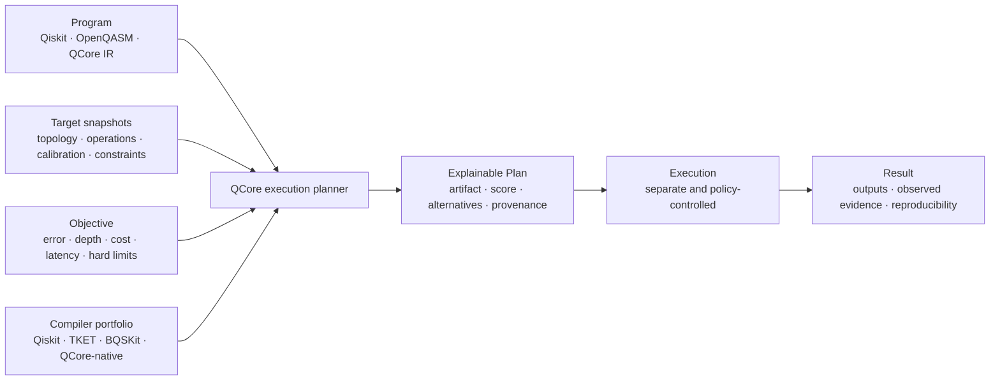

# QCore

**The open-source adaptive execution layer for quantum computing.**

QCore is being built to take a quantum **Program**, a set of available **Target**
snapshots, and an explicit **Objective**, then search for the strongest valid
execution **Plan** it can discover within a declared budget. The complete
product will explain why that plan won, why alternatives lost or were rejected,
and preserve the evidence needed to replay the decision. The
[current-status table](#where-the-project-is-today) distinguishes that North
Star from what is implemented now.

QCore is not trying to become another circuit-authoring toolkit or a thin wrapper
around provider APIs. It is intended to sit between the frameworks researchers
already use and the compilers and hardware they want to evaluate:



The core promise is **adaptive performance portability**: one program should
obtain strong, explainable plans as compilers, providers, devices, calibrations,
constraints, and user priorities change—without being rewritten for, or locked
to, one vendor. “Best” always means *best discovered under the stated objective,
target snapshots, evidence, and planning budget*; it never means an unexplained
claim of global optimality.

## What QCore is setting out to become

The execution planner is QCore's strategic control point. The complete product
direction is a vendor-neutral system that:

1. **Keeps the user's framework.** Qiskit and OpenQASM are first-class starting
   points; QCore complements existing SDKs instead of demanding a proprietary
   language or wholesale rewrite.
2. **Treats compilation as a portfolio.** QCore evaluates bounded strategies,
   options, and seeds from established compilers and carefully justified native
   passes because no single pipeline is best for every program and target.
3. **Understands targets as evidence snapshots.** Topology, native operations,
   timing, calibration data, constraints, provenance, and unknowns are captured
   immutably rather than hidden behind a live provider object.
4. **Optimizes for the user's objective.** Hard constraints and preferences such
   as estimated error, two-qubit gates, depth, cost, or latency are explicit,
   serializable inputs—not undocumented ranking policy.
5. **Preserves the whole decision.** The winning artifact, alternatives,
   failures, metrics, assumptions, versions, seeds, hashes, and rationale form a
   reproducible Plan, not a disposable transpiler output.
6. **Closes the loop with execution evidence.** Planning and execution remain
   separate, but later runtime feedback can compare predicted and observed
   outcomes and improve future evidence without turning selection into an opaque
   AI system.

The long-term architecture is an ergonomic Python API over a high-performance
Rust core through PyO3, with modular frontend, compiler, provider, and runtime
boundaries. It is designed for progressive lowering and future MLIR, LLVM, and
QIR interoperability—not as a claim that QCore has already implemented every
one of those ecosystems.

## Product path

QCore advances only when the evidence gate for the preceding question passes.
Experimental code may exist before a phase becomes an approved product claim.

| Stage | Product question | Evidence required to advance |
|---|---|---|
| Research kernel | Can programs, target snapshots, candidates, and metrics be compared without changing semantics? | Correctness, corruption detection, deterministic artifacts, and offline replay |
| Explainable planner | Does portfolio selection beat fair, equal-budget strong baselines on held-out workloads? | Predeclared uplift, no correctness regression, acceptable overhead, and independent reproduction |
| Runtime feedback | Do plans submit reliably, and do predictions relate to real hardware outcomes? | Complete lineage, safe job behavior, freshness checks, and repeated application-level evidence |
| Native compiler portfolio | Is there a specific compiler gap QCore can own better than orchestration alone? | Held-out advantage, expert correctness review, and justified maintenance cost |
| Managed and multi-provider execution | Is managed execution intelligence valuable without weakening the open local product? | Design-partner demand, security review, provider portability, and credible economics |
| Hybrid and fault-tolerant planning | Can QCore improve real heterogeneous or logical workloads? | Domain-expert ownership and material end-to-end, scientifically validated advantage |

The roadmap is not permission to build every layer. QCore can succeed as an
execution planner and provenance system without becoming a giant IDE, a cloud
marketplace, a universal compiler, a pulse-control stack, or a “quantum
operating system.”

## Where the project is today

The product is called **QCore**. The PyPI distribution, Python package, and
command-line program are called **`qplanck`**. The current worktree contains
important circuit, native compiler, routing, runtime, interoperability, and
provenance foundations plus a tested offline v0.1 research-kernel planner
vertical slice. That slice is not yet acceptance of every normative v0.1
requirement or a released hardware capability; see the
[implementation report](docs/implementation-report-v0.1.md) for exact evidence,
limitations, and the smoke boundary. The
[conformance matrix](docs/implementation-conformance-v0.1.md) records why the
full master-specification v0.1 gate remains open.

The exact [QCore Master Specification](docs/QCORE_MASTER_SPECIFICATION.md) is
the governing product and build specification. Repository-specific RFCs and
implementation-status documents may explain adaptations or gaps, but they do
not silently weaken or replace that master report.

| Area | Available in this worktree | Product boundary still open |
|---|---|---|
| Programs and interop | QCore circuits, a safe OpenQASM 3 subset, and optional Qiskit conversion | Broader source semantics and additional frontends |
| Targets | Provider-neutral targets and offline IBM BackendV2-like snapshot normalization | Credentialed discovery, target history, and proven multi-provider portability |
| Planning | Deterministic offline candidates, objectives, ranking, explanations, secret-free manifests, and strict caller-supplied offline replay | Full Qiskit/TKET/BQSKit portfolio, locked-environment replay acceptance, and master-spec benchmark gate |
| Native foundations | Rust compiler, topology routing, QIR lowering, and bounded simulation kernels | Evidence that native passes create held-out product advantage |
| Runtime and pulse | Provider-neutral contracts and an offline-tested Braket pulse adapter | Approved live provider evidence; no general hardware-execution claim |
| Performance evidence | One native routing smoke plus a 15-pair exact-small development comparison against ordinary and stronger Qiskit baselines | Ratified fair-resource protocol, untouched held-out corpus, full correctness/replay floors, statistics, and independent review |

The current evidence supports continuing the research; it does **not** establish
superiority over Qiskit, Cirq, TKET, BQSKit, or any provider's production stack.
Estimated error is a named approximation, not measured hardware fidelity.

## Current alpha implementation candidate

The current `qplanck 0.3.0a1` worktree contains:

- a fluent Python circuit API and immutable, versioned `CircuitIR`;
- a required Rust graph compiler and QIR kernel, exposed through stable Python
  dataclasses and versioned private byte interfaces;
- deterministic O0/O1 optimization plus O2 target-aware placement, topology
  routing, compiler-inserted SWAPs, exact basis lowering, resource metrics, and
  pass-by-pass provenance;
- a bounded Rust statevector simulator with frozen seeded sampling, classical
  measurement mapping, peak-memory/result preflight, and portable traces;
- direct OpenQASM 3 subset and optional Qiskit subset conversion;
- machine-readable conversion `LossReport` evidence;
- a QIR 2.0 Base Profile text exporter with capability checks, SWAP expansion,
  source/measurement maps, and composed compiler provenance;
- provider-neutral runtime, job, target, pulse, and calibration contracts;
- a separately packaged `qplanck-braket` adapter for the documented Amazon
  Braket pulse subset, with immutable capability snapshots and explicit channel
  maps;
- ASCII drawing and a small CLI.

Code presence is not release verification. Public implementation and performance
wording remains governed by the claim matrix and its correctness, benchmark,
wheel, provider, and release gates.

The Python O0/O1 implementation is retained only as a frozen correctness and
benchmark oracle; production compilation and QIR lowering require the native
extension. QCore does **not** claim that it beats Qiskit, Cirq, TKET, or another
tool until the published benchmark thresholds pass. The Braket adapter is
offline-tested, but no Braket hardware-execution claim is made until the
protected, single-task live smoke succeeds. See the
[machine-checked claim matrix](docs/claims.md) and
[standards contract](docs/sdk-standards.md).

## Install

The `0.3.0a1` worktree is not yet published on PyPI. Install it from this source
checkout and build the required native extension:

```bash
python -m pip install -e ".[dev,qiskit]"
maturin develop --release --locked
qplanck doctor
pytest
```

After the alpha is published, prebuilt native wheels will be the normal path:

```bash
pip install qplanck
```

Building from source requires the pinned Rust toolchain. `0.3` does not support
Pyodide, WebAssembly, PyPy, or free-threaded Python, and it has no JavaScript
binding, npm artifact, or browser runtime.

Amazon Braket pulse support is separately packaged in this repository and
currently supports Python 3.11–3.13. It is not yet a production provider
release; install the local package for offline development:

```bash
python -m pip install -e ./packages/qplanck-braket
```

The future PyPI command will be `pip install qplanck-braket` only after its
separate release gates pass.

Qiskit interoperability is optional when using a minimal environment:

```bash
python -m pip install -e ".[qiskit]"
```

## Build and simulate a circuit

```python
from qplanck import Circuit, Simulator

circuit = Circuit(2, name="bell").h(0).cx(0, 1).measure_all()
result = Simulator().run(circuit, shots=1_000, seed=7, trace=True)

print(result.counts)
print(circuit.draw())
print(result.trace.to_json(indent=2) if result.trace else "no trace")
```

## Compile for a hardware topology

```python
from qplanck import Circuit, Target, Topology
from qplanck.compiler import CompileOptions, compile

circuit = Circuit(3).cx(0, 2).measure_all()
target = Target.testing(
    3,
    topology=Topology.line(3),
    basis_gates=frozenset({"h", "rx", "rz", "cx"}),
)
compiled = compile(circuit, CompileOptions(optimization_level=2), target=target)

print(next(trial for trial in compiled.routing_trace.trials if trial.selected))
print(compiled.initial_layout.logical_to_physical)
print(compiled.final_layout.logical_to_physical)
print([event.pass_id for event in compiled.trace.events])
print(compiled.to_circuit().draw())
```

O2 validates width and basis support, evaluates deterministic placement trials,
routes over the target graph, retains abstract inserted SWAP evidence, lowers to
an exact target basis, and remaps terminal measurements through the final
layout. User-authored SWAP is an ordinary semantic operation and does not change
the compiler's logical-layout bookkeeping.

## Choose an offline execution plan

The implemented research API can compare deterministic compiler candidates,
retain every outcome, and explain its selected Plan without contacting a
provider:

```python
import qplanck

circuit = qplanck.Circuit(3).h(0).cx(0, 2).measure_all()
target = qplanck.Target.testing(
    3,
    topology=qplanck.Topology.line(3),
    basis_gates=frozenset({"h", "x", "rz", "cx"}),
    target_id="saved-line-target",
)
strategies = qplanck.qiskit_strategies((1, 3), seed=7)

decision = qplanck.plan(
    circuit,
    targets=[target],
    objective="minimize_depth",
    strategies=strategies,
)

print(decision.explain())
decision.manifest.write("planning-manifest.json")

replay = qplanck.replay(decision.manifest, strategies=strategies)
print(replay.passed, replay.environment_compatible)
```

`qplanck.qiskit_strategies()` creates an optional deterministic Qiskit portfolio
covering optimization levels 0–3. `qplanck.target_from_ibm_backend()` normalizes
an already-obtained IBM BackendV2-like object into an immutable offline snapshot;
it does not discover hardware, read credentials, or submit jobs. Replay requires
exact caller-supplied strategy IDs, versions, and options; it never guesses a
plugin or contacts a provider. The complete master-spec portfolio,
locked-environment replay floor, and evidence gate remain open as recorded in
the [conformance matrix](docs/implementation-conformance-v0.1.md).

## Inspect conversion loss

```python
from qplanck import Circuit

circuit = Circuit(2, name="bell").h(0).cx(0, 1).measure_all()
exported = circuit.to_qasm3_with_report()

print(exported.value)
print(exported.report.to_json(indent=2))
```

The supported semantic subset converts directly; QCore does not route a Qiskit
circuit through Cirq or OpenQASM. Metadata that the target representation does
not preserve is listed explicitly. Unsupported gates and custom definitions are
rejected instead of silently decomposed.

## Export the supported subset to QIR

```python
from qplanck import Circuit
from qplanck.qir import export_qir

circuit = Circuit(2).h(0).cx(0, 1).measure_all()
module = export_qir(circuit)

print(module.text)
print(module.manifest.to_dict())
```

The native exporter emits deterministic opaque-pointer LLVM text for the QIR 2.0
Base Profile, expands SWAP to three CNOT calls, and records required QIS calls,
resource mappings, target identity, and compiler-to-QIR provenance. QIR import,
adaptive-profile lowering, arbitrary target QIS, and a bundled execution runtime
remain outside this release.

## Define a pulse calibration safely

```python
from qplanck.pulse import (
    CalibrationKey,
    CalibrationLibrary,
    DriveChannel,
    GaussianWaveform,
    PulseProgram,
)

program = PulseProgram(name="x_q0").play(
    start=0,
    channel=DriveChannel(0),
    waveform=GaussianWaveform(duration=160, sigma=40.0, amplitude=0.25),
)
calibrations = CalibrationLibrary().with_calibration(
    CalibrationKey("x", (0,)),
    program,
)

print(calibrations.to_json(indent=2))
```

This is QCore's hardware-neutral schema, not a claim of OpenPulse source
compatibility. The Braket adapter maps its supported subset only from captured
provider capability metadata, requires matching clocks and explicit one-to-one
channel/port mappings, rejects `Acquire`, and refuses submission when the device
snapshot changes.

## Current circuit subset

- gates: `h`, `x`, `y`, `z`, `s`, `t`, `rx`, `ry`, `rz`, `cx`, `cz`, `swap`;
- finite numeric parameters only;
- terminal, uniquely mapped measurements only;
- little-endian internal state indexing;
- execution-trace snapshots default to at most eight qubits;
- the default local peak-execution budget is 256 MiB and the default serialized
  result budget is 64 MiB.

QCore remains an early alpha. The public APIs are tested but may evolve during
`0.x`; schemas carry independent version identifiers.

## CLI

```bash
qplanck doctor
qplanck draw examples/bell_state.qasm
qplanck trace examples/bell_state.qasm --output trace.json
```

`draw` and `trace` accept either QCore IR JSON or the supported OpenQASM 3
subset.

## Documentation

- [QCore master specification](docs/QCORE_MASTER_SPECIFICATION.md)
- [Product thesis](docs/thesis.md)
- [Normative v0.1 planner specification](docs/spec-v0.1.md)
- [v0.1 research-kernel implementation report](docs/implementation-report-v0.1.md)
- [Exact-small planner development report](docs/planner-development-report-v0.1.md)
- [v0.1 implementation conformance matrix](docs/implementation-conformance-v0.1.md)
- [Canonical strategic roadmap](docs/roadmap.md)
- [SDK standards and capability contract](docs/sdk-standards.md)
- [Architecture](docs/architecture.md)
- [Native core contract](docs/architecture/native-contract.md)
- [Interoperability](docs/interop.md)
- [Compiler pipeline](docs/architecture/compiler-pipeline.md)
- [IR strategy](docs/architecture/ir-strategy.md)
- [PyPI publishing guide](docs/publishing.md)
- [Changelog](CHANGELOG.md)
- [Detailed historical roadmap](docs/roadmap/qcore-roadmap.md)
- [Contributing](CONTRIBUTING.md)
- [Security](SECURITY.md)

## License

Apache-2.0.
