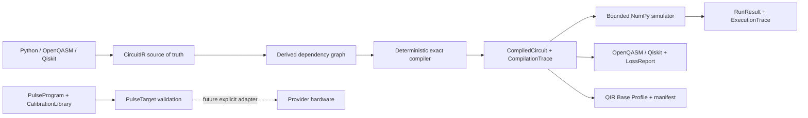

# QCore Architecture

QCore is the product brand; `qplanck` is the Python distribution and package.
The `0.2.0a1` architecture separates source circuits, derived compiler analyses,
external lowering formats, pulse programs, and execution results so no format is
misrepresented as a universal IR.

## Data flow

## Circuit and compiler layer

- `Circuit` is the fluent user-facing builder.
- `CircuitIR` (`qplanck.ir.v0.1`) is immutable and deterministically serialized.
- `DependencyGraph` is derived from operation/qubit conflicts and is never a
  second serialized source of truth.
- `compile()` levels 0 and 1 validate, optionally apply exact local rewrites, and
  collect resource metrics.
- `CompiledCircuit` retains source/output IR, source/output graphs, options,
  before/after metrics, and `CompilationTrace`.
- Every pass event records stable identity/version, input/output hash, changed
  state, metrics, and rewrite evidence.

The current compiler is pure Python. It performs no placement, topology routing,
SWAP insertion, target-basis synthesis, scheduling, or native acceleration.

## Interoperability layer

- OpenQASM 3 and Qiskit are direct supported-subset adapters.
- `ConversionResult` and `LossReport` make dropped information explicit.
- QIR is an experimental lowering target with a separate capability/manifest
  contract; it does not replace `CircuitIR`.
- Unsupported semantics fail closed.

See [Interoperability](interop.md) for the detailed matrix.

## Pulse layer

`PulseProgram` (`qplanck.pulse.v0.1`) is intentionally distinct from gate-level
`CircuitIR`. It provides:

- typed drive, measure, acquire, and control channels;
- Gaussian, constant, and sampled waveforms with finite amplitude checks;
- play, delay, phase/frequency frame, and acquisition instructions;
- absolute integer-sample scheduling with overlap validation;
- `PulseTarget` timing, alignment, channel, duration, and amplitude constraints;
- immutable `CalibrationKey` and `CalibrationLibrary` contracts;
- deterministic JSON round trips.

The model is local and hardware-neutral. Provider adapters must explicitly map
channels and clocks, own calibration snapshots, and reject unsupported features.
No hardware transport, credentials, job submission, or OpenPulse source exporter
is included.

## Simulator and result layer

- `Simulator("statevector")` is the local exact NumPy reference backend.
- Internal basis indexing is little-endian.
- Full state display uses `q[n-1]...q[0]`; explicit sampling uses dense
  `c[n-1]...c[0]` measurement mappings.
- Unmeasured circuits retain the documented implicit-all-qubits sampling mode.
- Statevector allocation is checked against a configurable byte budget before
  allocation; the default is 256 MiB.
- `ExecutionTrace` (`qplanck.trace.v0.1`) records initial and per-operation state
  snapshots and probabilities.
- Trace generation defaults to at most eight qubits.

## Performance boundary

The dependency graph and reference compiler establish semantic and provenance
contracts that a future native engine must preserve. Native code requires public
profiling and equivalent-semantics benchmarks plus supported-platform packaging.
No current documentation or release announcement may claim comparative compiler
speed without that evidence.

See the [SDK standards contract](sdk-standards.md) for the release claim rules.
