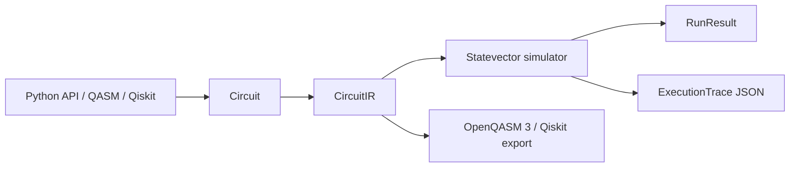

# QCore Architecture

QCore is the product brand. `qplanck` is the Python package.

The v0.1 alpha is intentionally small:

- `Circuit` is the user-facing builder API.
- `CircuitIR` is the stable internal representation.
- `Simulator("statevector")` is the only backend.
- `ExecutionTrace` is the portable contract for future visual debuggers.
- OpenQASM 3 and Qiskit adapters convert into and out of `CircuitIR`.

## Data Flow

## IR Conventions

- Schema version: `qplanck.ir.v0.1`
- Internal basis indexing: little-endian
- Public bitstring display: `q[n-1]...q[0]`
- Measurements are terminal in v0.1.
- Gate parameters must be numeric in v0.1.

## Trace Conventions

Trace schema version: `qplanck.trace.v0.1`.

Each trace contains:

- the serialized circuit IR
- metadata for backend, endianness, and bitstring display order
- an initial state step
- one step after every gate operation
- statevector snapshots encoded as `{real, imag}`
- probability dictionaries keyed by public bitstrings

Trace generation defaults to at most 8 qubits to avoid unexpectedly large JSON
payloads.
