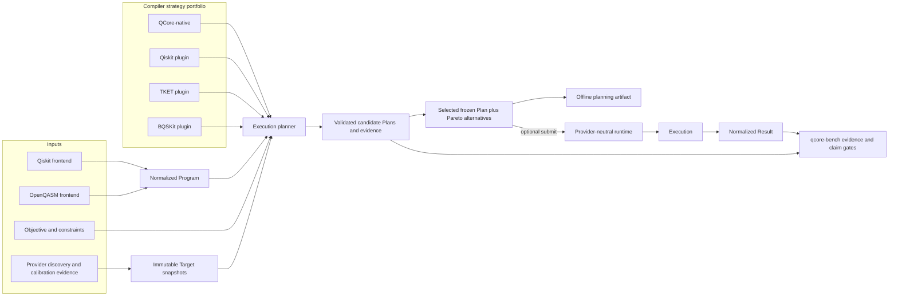
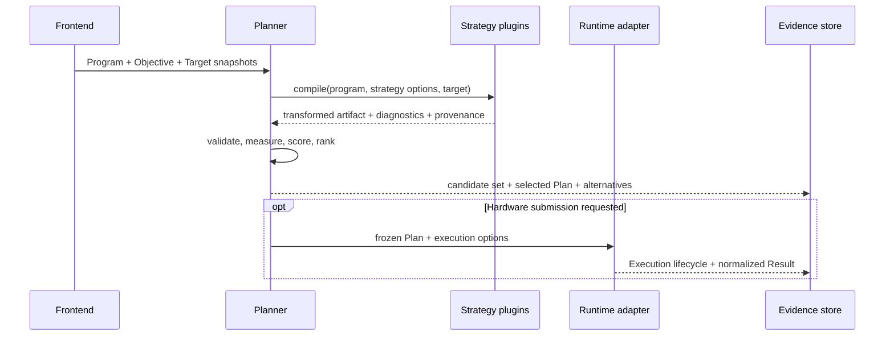
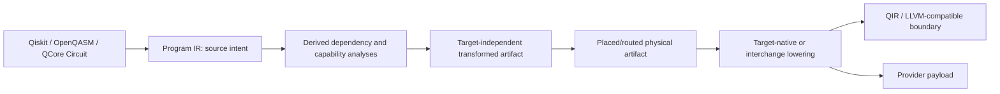

# QCore Architecture

QCore is the adaptive execution layer for quantum computing. Given a quantum
program, a target set, and an objective, it should produce the strongest
evidence-backed execution plan it can justify—not merely another representation
of the circuit. Its core promise is **adaptive performance portability**: one
program can obtain strong, explainable plans as compilers, providers, devices,
calibrations, and user priorities change, without binding the program to one
vendor.

QCore is the product and architecture name. `qplanck` remains the current Python
distribution and import package while the project handles the occupied `qcore`
package name deliberately. The planner product milestone called **v0.1** is not
the same thing as the package version: the repository also contains
`0.3.0a1` package work. QCore is open-source-first and vendor-neutral: adapters
may integrate commercial services, but no provider owns the core contracts or
planner policy.

This document describes both the product architecture and the implemented alpha
foundation. Status labels are intentional:

- **Implemented alpha** means a contract or path exists in this repository and
  still requires its normal release evidence.
- **v0.1 requirement** means normative planner scope; it must not be presented as
  an available API until implementation and tests establish that fact.
- **Later direction** means architectural intent, not a shipped capability.

See the governing [QCore Master Specification](QCORE_MASTER_SPECIFICATION.md),
the repository [v0.1 companion](spec-v0.1.md), and the [claim registry](claims.md)
for wording that current evidence permits.

## System context

```mermaid
flowchart LR
    subgraph Inputs
        QK["Qiskit frontend"]
        OQ["OpenQASM frontend"]
        OBJ["Objective and constraints"]
        DISC["Provider discovery and calibration evidence"]
    end

    QK --> PROGRAM["Normalized Program"]
    OQ --> PROGRAM
    DISC --> TARGETS["Immutable Target snapshots"]
    PROGRAM --> PLANNER["Execution planner"]
    OBJ --> PLANNER
    TARGETS --> PLANNER

    subgraph Portfolio["Compiler strategy portfolio"]
        QC["QCore-native"]
        QIS["Qiskit plugin"]
        TK["TKET plugin"]
        BQ["BQSKit plugin"]
    end

    QC --> PLANNER
    QIS --> PLANNER
    TK --> PLANNER
    BQ --> PLANNER
    PLANNER --> CAND["Validated candidate Plans and evidence"]
    CAND --> SELECTED["Selected frozen Plan plus Pareto alternatives"]
    SELECTED --> OFFLINE["Offline planning artifact"]
    SELECTED -->|"optional submit"| RUNTIME["Provider-neutral runtime"]
    RUNTIME --> EXEC["Execution"]
    EXEC --> RESULT["Normalized Result"]
    CAND --> BENCH["qcore-bench evidence and claim gates"]
    RESULT --> BENCH
```

The execution planner is the strategic control point. Frontends, compiler
strategies, target sources, and runtimes remain replaceable plugins around stable
QCore contracts. The planner compares normalized evidence rather than treating
one vendor SDK or one compiler's internal object graph as the product model.

## Core domain contracts

All durable contracts are immutable, schema-versioned, canonically serialized,
and content-addressed where their semantics permit it. Unknown values remain
explicitly unknown; absence is never silently interpreted as zero, unlimited, or
supported. Operational identifiers and provider references are recorded
separately from semantic hashes.

| Contract | Responsibility | Required invariants and identity |
|---|---|---|
| **Program** | Preserve normalized quantum intent plus source mapping, parameters, classical behavior, and required capabilities. It is produced by a frontend and is independent of a provider target. | A schema version and canonical program hash identify normalized semantics. Frontend name/version, parser settings, source hash, and loss diagnostics remain provenance. Import that cannot preserve required semantics fails closed. |
| **Target** | Describe one provider-neutral execution capability snapshot: topology, native instructions, properties, timing, constraints, capabilities, and evidence provenance. | A target snapshot is immutable and carries a snapshot ID, canonical snapshot hash, capture timestamp, source/plugin version, and provider/device reference. Declared capabilities and observed/calibrated evidence are separate. Partial fields use explicit unknown values. No credentials or provider SDK objects are allowed. |
| **Objective** | State hard constraints, metric directions, weights or priorities, tolerances, and deterministic tie-breaking policy. | A schema version and objective hash identify normalized scoring semantics. Units, estimation models, missing-data policy, and assumptions are explicit. Candidates violating hard constraints cannot win through a favorable weighted score. |
| **Plan** | Freeze one valid way to run a Program against one Target snapshot. It identifies the transformed artifact, compiler strategy and exact options/seeds, metrics, score/rank, rationale, assumptions, and provenance. | The plan hash covers the program, transformed artifact, strategy identity, target snapshot hash, objective, metrics, and selection evidence. A plan never follows a mutable “latest calibration.” Rejected candidates have separate evidence records; retained valid alternatives may form a Pareto set. |
| **Execution** | Represent a submitted or active run derived from exactly one frozen Plan. It owns lifecycle state and safe provider job references. | An execution has a QCore operational ID, plan hash, submission timestamp, provider adapter version, target snapshot identity, and monotonic state. Submission must not rewrite the Plan; target drift or capability mismatch requires rejection or explicit replanning. |
| **Result** | Return normalized outputs and diagnostics while linking the run to reproducibility evidence and provider-owned artifacts. | A result has a schema version and content hash, references its execution and plan, records completion timestamps and artifact hashes, and namespaces provider extras. It never embeds credentials or opaque executable SDK objects. |

The contracts form a one-way lifecycle:

```mermaid
sequenceDiagram
    participant F as Frontend
    participant P as Planner
    participant S as Strategy plugins
    participant R as Runtime adapter
    participant E as Evidence store

    F->>P: Program + Objective + Target snapshots
    P->>S: compile(program, strategy options, target)
    S-->>P: transformed artifact + diagnostics + provenance
    P->>P: validate, measure, score, rank
    P-->>E: candidate set + selected Plan + alternatives
    opt Hardware submission requested
        P->>R: frozen Plan + execution options
        R-->>E: Execution lifecycle + normalized Result
    end
```

Planning and execution are deliberately separate. A user can inspect, compare,
export, or archive a Plan without spending money or supplying provider
credentials. Hardware submission is an explicit subsequent action.

## Layering and plugin boundaries

Dependencies point inward toward contracts. Core code does not import provider
SDKs, hosted services, UI packages, or optional external compilers.

| Layer | Owns | Boundary rule |
|---|---|---|
| Python API and CLI | Ergonomic builders, frontend selection, planner/runtime entry points, public dataclasses | Stable user surface; it does not expose PyO3 byte protocols or provider SDK objects. |
| Frontends | Qiskit and OpenQASM parsing/import, source mapping, capability and loss diagnostics | Both are first-class contracts. The implemented alpha supports documented static subsets; v0.1 must define and test the accepted subset rather than imply universal language support. |
| Core contracts | Program, Target, Objective, Plan, Execution, Result, manifests, diagnostics, canonical schemas | Provider-neutral and safe to serialize. Decoding performs no plugin loading, code execution, credential discovery, or network access. |
| Compiler strategies | Normalize calls to QCore-native passes and optional Qiskit, TKET, and BQSKit adapters | Each strategy declares identity/version, accepted Program capabilities, options/schema, determinism limits, target requirements, and output validation. Optional integrations remain separate dependencies/plugins. |
| Planner | Candidate enumeration, validation, metric extraction, constraint evaluation, scoring, ranking, explanation, Pareto retention | The planner consumes normalized artifacts and evidence. It must not compare undocumented compiler-private estimates as though they had identical semantics. |
| Target sources | Provider discovery, capability/calibration ingestion, normalization, immutable snapshotting | Raw provider payloads may be retained only as redacted, content-addressed evidence references. Declared and observed facts remain distinguishable. |
| Runtime adapters | Submission, polling, cancellation where supported, status translation, result normalization | Credentials come only from the provider's ambient credential chain. Provider clients and secrets never enter core objects or manifests. |
| Evidence system | `qcore-bench`, manifests, raw benchmark artifacts, comparable reports, claim decisions | A benchmark result is evidence under a named environment and corpus, never a blanket hardware or superiority guarantee. |

Plugin discovery must be explicit and bounded. A plugin is identified by a stable
strategy/provider ID, package and implementation version, contract version, and
capability declaration. Plugin failures become structured diagnostics; they do
not mutate other candidates or silently change the candidate set. Exact plugin
versions and options are part of Plan provenance.

## Program ingestion and progressive lowering

Qiskit objects and OpenQASM source are first-class input paths. Each frontend
normalizes accepted semantics to the QCore Program/IR contract and emits source
provenance plus explicit loss or unsupported-capability diagnostics. The current
`Circuit` builder remains an ergonomic QCore-native frontend.

The compiler architecture follows progressive lowering through versioned levels:

```mermaid
flowchart LR
    SRC["Qiskit / OpenQASM / QCore Circuit"] --> PIR["Program IR: source intent"]
    PIR --> ANALYSIS["Derived dependency and capability analyses"]
    ANALYSIS --> TIR["Target-independent transformed artifact"]
    TIR --> PIR2["Placed/routed physical artifact"]
    PIR2 --> LOW["Target-native or interchange lowering"]
    LOW --> QIR["QIR / LLVM-compatible boundary"]
    LOW --> PROVIDER["Provider payload"]
```

**Implemented alpha:** `CircuitIR` (`qplanck.ir.v0.1`) is the canonical static
source representation; the required Rust kernel derives a dependency graph,
performs exact O0/O1 transformations, and performs O2 placement, routing, SWAP
insertion, and supported target-basis lowering. The native exporter emits the
documented QIR 2.0 Base Profile subset with composed provenance. OpenQASM and
Qiskit adapters cover their documented subsets.

**Later direction:** QCore should remain compatible with MLIR/LLVM design ideas:
typed operations, explicit dialect/capability boundaries, progressive lowering,
versioned IR contracts, pass provenance, and QIR interoperability. This is not a
claim that QCore embeds MLIR, has a public MLIR dialect, implements arbitrary
LLVM/QIR programs, or already exposes a complete HIR/MIR/LIR stack. New durable
IR levels require an accepted semantic use case and migration contract.

See the [IR strategy](architecture/ir-strategy.md),
[compiler pipeline](architecture/compiler-pipeline.md), and
[native byte contract](architecture/native-contract.md) for current detail.

## Target model and snapshot evidence

A QCore Target is a provider-neutral, immutable observation used for planning
and preflight. The v0.1 target schema must be able to represent:

- provider and device identity without embedding a provider client;
- qubit count, connectivity/topology, directionality, and availability;
- native operations, arity, locations, parameter constraints, and instruction
  set/version;
- qubit and instruction properties such as error estimates, duration, and
  calibration timestamps, including uncertainty or provenance where available;
- timing units, alignment and scheduling constraints, measurement behavior, job
  and payload limits, dynamic/pulse/control capabilities, and other explicit
  constraints;
- declared provider capabilities separately from observed or calibrated evidence;
- partial, stale, conflicting, or unknown fields without inventing certainty;
- snapshot ID, canonical hash, capture timestamp, source payload/artifact hash,
  source version, and normalization plugin version.

The snapshot timestamp is observational evidence, while the canonical hash
identifies normalized semantic content. Re-fetching identical capabilities may
produce a new capture record without pretending the content changed. Conversely,
changed calibration evidence produces a distinct snapshot hash and requires a new
Plan. Target validation fails closed when a candidate requires a capability that
is false, unknown under the Objective policy, stale beyond a declared constraint,
or semantically incompatible.

**Implemented alpha:** `Topology`, `InstructionSupport`, `TargetLimits`,
`Target`, and `Layout` provide immutable topology, basis, limit, provider/model,
snapshot identity, metadata, schema, and hashing foundations for compilation.
They do not yet constitute the complete v0.1 IBM calibration/evidence schema.
The separate `qplanck-braket` pulse adapter has an offline-verified snapshot and
channel-mapping contract; this does not establish live provider execution or the
IBM-first planner path.

## Compiler portfolio and planner

QCore v0.1 orchestrates a portfolio; it does not try to replace every compiler.
The initial normalized strategy boundary covers Qiskit, TKET, BQSKit, and
QCore-native passes/adapters. External compilers are optional plugins so a core
install remains vendor-neutral and provider SDK dependency changes cannot leak
into contract types.

For a Program, Objective, accessible Target snapshots, enabled strategies, and
explicit option sets, the planner must deterministically:

1. Construct the declared Program × strategy × options × Target candidate set.
2. Reject unsupported semantic or capability combinations with coded evidence.
3. Compile each remaining candidate with exact versions, options, seeds, budgets,
   and timeouts recorded.
4. Validate output structure and, where feasible, semantic equivalence before
   admitting measurements.
5. Normalize metrics and their estimation models. v0.1 includes at least
   two-qubit gate count, depth, SWAP count, and explicitly modeled estimated
   error.
6. Apply hard Objective constraints before weighted or lexicographic scoring.
7. Rank valid candidates with stable metric normalization and tie-breaking,
   retaining the full candidate evidence and useful Pareto alternatives.
8. Freeze the selected Plan and explain the winning tradeoffs, assumptions,
   rejected candidates, and close alternatives.

Determinism includes candidate ordering, seeds, strategy options, metric units,
score normalization, and tie-breaking. A missing plugin or failed candidate is
recorded; it must not silently reshape an allegedly equivalent rerun.

Compiler metrics and calibration-derived scores are estimates under named models,
snapshots, and assumptions. Lower estimated error, fewer SWAPs, or lower depth is
not a hardware-success guarantee. Hardware outcome metrics become distinct
evidence after execution and must never be retroactively presented as compile-time
knowledge.

**Implemented alpha code:** QCore has a required native compile path with O0/O1,
deterministic target-aware O2 routing, and a frozen Python correctness oracle. A
bounded offline planner now compares Qiskit and QCore-native strategies, applies
an Objective, ranks and retains Pareto candidates, explains the selected Plan,
and normalizes an already-obtained IBM BackendV2-like object into a provider-neutral
Target snapshot. The complete normative v0.1 portfolio and provider path remain
partial: TKET/BQSKit, live IBM discovery and execution, enforceable resource
budgets, wider correctness tiers, and the master-specification evidence gate are
not implemented or not yet satisfied.

## Runtime and provider adapters

The provider-neutral runtime consumes a frozen Plan and produces an Execution and
Result. The v0.1 provider path begins with IBM for device discovery, Target
ingestion/snapshotting, submission, polling, cancellation where supported, and
result normalization. IBM SDK types remain inside the IBM adapter.

Before submission, an adapter validates the Plan against the referenced snapshot
and the current provider capability policy. Snapshot drift fails closed or causes
an explicit replan; it never silently recompiles and submits a different artifact.
One QCore execution records the exact provider job reference(s), retry policy,
timestamps, and normalized lifecycle transitions. Provider-specific details are
namespaced or represented as redacted external artifact references.

Provider credentials are obtained only through the provider SDK's ambient
credential chain. They are not accepted as serializable Objective/Plan fields,
included in hashes, logged in diagnostics, written to manifests, or returned in
Results. Core modules import no IBM, Braket, or other provider SDK.

**Implemented alpha:** `Backend`, `Job`, `JobStatus`, `ExecutionOptions`,
`ExperimentManifest`, `LocalSimulator`, and `MockBackend` establish and test the
provider-neutral lifecycle. A separate `qplanck-braket` package implements the
documented pulse subset and offline adapter validation, while live hardware
execution remains claim-gated. The IBM planner/runtime adapter is a v0.1
requirement, not an implemented alpha claim.

### Local and pulse execution foundations

The implemented local `Simulator("statevector")` is a Python facade over the
required bounded Rust statevector kernel. It uses documented little-endian basis
indexing, enforces memory/result budgets before allocation, and can emit a
versioned `ExecutionTrace`. `LocalSimulator` and `MockBackend` exercise the shared
sync/async, cancellation, timeout, state-monotonicity, result-normalization, and
manifest-redaction contracts. This is a reference execution path, not a claim of
hardware fidelity or competitive simulator performance.

Pulse semantics remain a distinct typed layer rather than metadata on a gate
Program. The implemented `PulseProgram`, `PulseTarget`, `CalibrationLibrary`, and
`CalibratedCircuit` contracts model explicit channels, finite waveforms,
integer-sample scheduling, timing/alignment constraints, and calibration/snapshot
identity. The separate `qplanck-braket` adapter derives frame mappings from
captured provider capabilities, requires matching clocks and explicit channels,
rejects acquisition semantics it cannot preserve, revalidates snapshot identity
before submission, and obtains credentials only from the AWS SDK chain. Offline
adapter conformance is implemented; a provider-execution claim still requires
the protected live evidence gate. This pulse work is complementary to, not a
substitute for, the IBM-first v0.1 planner/runtime path.

See [runtime and backends](architecture/runtime-and-backends.md) and the accepted
[runtime RFC](../rfcs/0004-backend-interface.md).

## Reproducibility and provenance manifest

Every selected Plan, and every Execution when submission occurs, must be
reconstructable from a versioned manifest. At minimum the manifest records:

- input/source hash, normalized Program hash, and IR schema version;
- frontend/parser identity and version;
- compiler, provider, and plugin names and exact versions;
- exact strategy options, seeds, budgets, timeout policy, and deterministic
  candidate enumeration order;
- target snapshot ID, hash, capture timestamp, and safe source provenance;
- Objective schema, weights/priorities, constraints, metric definitions, missing
  data policy, and estimation-model versions;
- complete candidate set identity, validation outcomes, metrics, scores,
  assumptions, rationale, rejected candidates, and retained alternatives;
- selected Plan hash and transformed artifact hash;
- environment, Python/Rust/toolchain, platform, and relevant dependency versions;
- execution ID, safe provider job reference, lifecycle timestamps, retry policy,
  and cancellation/timeout outcome when applicable;
- normalized Result hash and referenced raw/output artifact hashes.

Manifest schemas are canonical and migration-aware. Secrets, credential material,
signed URLs, local private paths, provider client objects, and unrestricted raw
environment dumps are prohibited. Content hashes establish identity and
integrity, not trust; signatures or attestations are separate concerns.

## Rust core and Python surface

Python is the ergonomic public API. Rust, exposed through PyO3 and versioned byte
contracts, owns performance-critical validated models, canonical hashing,
graph/IR transformations, scoring/planning kernels, and deterministic artifact
generation where profiling and benchmarks justify the boundary. Rust panics must
be translated to typed Python errors, and malformed or version-mismatched native
responses fail closed.

**Implemented alpha:** the Maturin/PyO3 extension is required for production
compilation, routing, QIR lowering, and the bounded statevector simulator. Public
Python dataclasses reconstruct native responses; native implementation metadata
is observational and excluded from semantic IR hashes. The Python O0/O1 compiler
is retained only as a non-production differential oracle. The new planner domain
contracts and portfolio scoring kernel are not yet all implemented in Rust.

Rust is an implementation fact, not evidence of speed or output superiority.
Native admission and comparative wording remain subject to the
[SDK standards](sdk-standards.md) and [claim matrix](claims.md).

## `qcore-bench` evidence system

`qcore-bench` is a first-class product subsystem, not a one-off timing script. A
reproducible benchmark case identifies:

- versioned workloads and correctness oracles;
- immutable target snapshots and topology/calibration provenance;
- Objectives and metric/estimation-model versions;
- compiler strategy/plugin identities, exact options, trials, seeds, and thread
  policy;
- warm-up, repetitions, isolation, timeouts, and machine/environment capture;
- raw per-run artifacts plus medians, dispersion, confidence intervals, failures,
  and comparable reports;
- semantic/correctness results before timing evidence;
- separate compile-time performance, output-quality metrics, and eventual
  hardware outcome metrics.

Claim evaluation fails closed when required cases, dependency pins, correctness,
raw artifacts, or statistical evidence are missing. A result on one corpus and
machine supports only its registered wording. It does not prove universal
performance portability or hardware advantage.

**Implemented alpha:** the repository contains a reproducible native/oracle and
target-routing benchmark harness with correctness gates, raw reports, machine
manifests, and threshold-based claim evaluation. Published competitive and
provider-execution claims remain gated until the required evidence passes. v0.1
must extend this system to the strategy portfolio, IBM Target snapshots,
Objectives, selection explanations, and candidate-level evidence.

See the [benchmark guide](../benchmarks/README.md).

## Current implementation boundary

| Area | Implemented alpha foundation | v0.1 planner requirement |
|---|---|---|
| Inputs | QCore `Circuit`, supported OpenQASM 3 subset, Qiskit conversion adapter | Stable first-class Qiskit and OpenQASM frontend contracts with explicit capability/loss behavior |
| IR/compiler | Versioned `CircuitIR`; required Rust O0/O1/O2 graph compiler, target-aware routing and supported basis lowering; QIR Base Profile subset | Portfolio strategy protocol and normalized artifacts across Qiskit, TKET, BQSKit, and QCore-native strategies |
| Target | Immutable topology, instructions, limits, layout, hashes, and snapshot fields | IBM ingestion plus declared/observed properties, timing, calibration/error evidence, staleness and unknown-data policy |
| Planning | Single compile invocation and routing/compilation evidence | Program × strategy × options × Target candidates, Objective, deterministic ranking, explanations, rejected evidence, Pareto alternatives, frozen Plan |
| Runtime | Provider-neutral contracts, local/mock implementations; separate offline-verified Braket pulse adapter | IBM-first optional submission lifecycle derived from a frozen Plan |
| Evidence | Native/oracle and routing benchmark harness; machine-checked claim gates | Planner-wide comparable reports and candidate-selection evidence on versioned IBM snapshots |

This boundary is the documentation claim boundary. Future editors must inspect
code, tests, release artifacts, and the machine-checked claim registry before
moving anything from “v0.1 requirement” to “implemented.”

## Detailed architecture references

- [QCore system overview](architecture/qcore-overview.md)
- [Compiler pipeline](architecture/compiler-pipeline.md)
- [Intermediate representation strategy](architecture/ir-strategy.md)
- [Runtime and backend contracts](architecture/runtime-and-backends.md)
- [Native compiler contract](architecture/native-contract.md)
- [Plugin system](architecture/plugin-system.md)
- [Interoperability matrix](interop.md)
- [Security threat model](security/threat-model.md)
- [Roadmap](roadmap.md)
