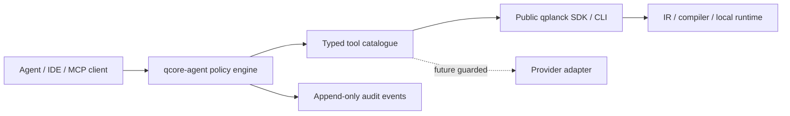

# AI-Agent Architecture

> Status: Proposed  
> Initial package: `qcore-agent` (future, optional)

## Principle

**Decision:** QCore will be agent-operable, not agent-dependent. The compiler,
runtime, schemas, diagnostics, and CLI remain deterministic without an LLM. Agent
support is a separate package that exposes bounded typed tools over public APIs.

**Inference:** A chatbot alone would add no durable architecture. Stable JSON
schemas, coded errors, provenance, dry runs, permissions, and replay artifacts are
the reusable advantage for humans and agents alike.

## Boundary



- `qcore-agent` may depend on QCore; QCore never imports agent dependencies.
- A future MCP server is a transport over the same tool contracts, not a second
  implementation.
- The policy engine authorizes each invocation by permission, budget, workspace,
  backend, and side-effect class.
- Tool output is treated as untrusted data when reintroduced into an LLM context.

## Tool catalogue

| Tool ID | Purpose | Side-effect class | Phase | Key output |
|---|---|---|---|---|
| `circuit.create` | Construct CircuitIR from bounded structured operations | Workspace write | 1/2 | IR artifact + diagnostics |
| `circuit.validate` | Validate schema and semantics | Read/compute | 1 | Diagnostics + requirements |
| `circuit.import_qasm3` | Parse supported QASM subset | Read/compute | 1 | IR + source map/loss report |
| `circuit.draw` | Render ASCII or registered safe view | Read/compute | 1 | Text/artifact reference |
| `compiler.preview` | Compile without execution | Read/compute | 1 | CompiledCircuit + trace summary |
| `compiler.compare` | Compare explicit pipelines | Read/compute | 2 | Metrics/diffs; no winner claim without objective |
| `compiler.explain_event` | Retrieve rule, provenance, diagnostics for one event | Read | 1 | Structured explanation evidence |
| `backend.list` | List policy-approved backends without loading untrusted plugins | Read | 1 | IDs, trust, availability |
| `backend.capabilities` | Inspect immutable target snapshot | Read | 1 | Target + hash |
| `simulation.run` | Execute local backend under hard budget | Compute | 1 | RunResult + manifest |
| `job.submit` | Submit remote work | External effect/spend | 6 | Job handle + confirmation receipt |
| `job.status` | Read job lifecycle | Network read | 6 | Stable/provider status |
| `job.cancel` | Request cancellation | External effect | 6 | Accepted flag + audit ID |
| `experiment.reproduce` | Validate and replay a manifest | Compute or guarded network | 1 local / 6 remote | Comparison report |
| `docs.search` | Search version-matched local documentation | Read | 2 | Cited snippets/paths |
| `lesson.check` | Evaluate declared exercise invariants | Compute | 3 | Rubric results without hidden answer leakage |

**Decision:** Remote submission, cancellation, credentials, and spend are absent
from the first package release. Their schemas may be designed but cannot be
enabled by prompt text alone.

## Common invocation envelope

The following JSON is **Proposed**:

```json
{
  "schema_version": "qcore.agent.request.v0.1",
  "request_id": "req-000123",
  "tool": "simulation.run",
  "arguments": {
    "circuit_ref": "sha256:...",
    "shots": 1000,
    "seed": 7,
    "trace": "summary"
  },
  "policy": {
    "dry_run": false,
    "max_qubits": 12,
    "max_memory_bytes": 268435456,
    "max_duration_ms": 30000,
    "workspace": "lesson-bell"
  }
}
```

The response is **Proposed**:

```json
{
  "schema_version": "qcore.agent.response.v0.1",
  "request_id": "req-000123",
  "status": "succeeded",
  "artifacts": [
    {"kind": "run_result", "ref": "sha256:..."},
    {"kind": "experiment_manifest", "ref": "sha256:..."}
  ],
  "diagnostics": [],
  "audit_event_id": "audit-000456"
}
```

## Example tool schema

This abbreviated `simulation.run` schema is **Proposed**:

```json
{
  "type": "object",
  "additionalProperties": false,
  "required": ["circuit_ref", "shots"],
  "properties": {
    "circuit_ref": {"type": "string", "pattern": "^sha256:[0-9a-f]{64}$"},
    "shots": {"type": "integer", "minimum": 0, "maximum": 1000000},
    "seed": {"type": ["integer", "null"]},
    "trace": {"enum": ["off", "summary", "full"]}
  }
}
```

Server policy may impose stricter limits than the schema. A schema maximum is not
authorization.

## Deterministic behavior

- Validate all arguments before resolving artifacts or loading backends.
- Use canonical result envelopes and stable diagnostic ordering.
- Require explicit backend, pipeline, target snapshot, and seed; defaults resolve
  to versioned IDs recorded in the response.
- `dry_run=true` performs schema, policy, capability, and resource preflight but
  does not execute or submit.
- Tool selection never uses fuzzy names inside the execution layer.
- Documentation search returns source/version references; generated explanations
  are clearly separated from compiler evidence.

## Permissions

| Permission | Examples | Default |
|---|---|---|
| `artifact:read` | Read IR, traces, manifests in approved workspace | Allow within workspace |
| `artifact:write` | Create circuit/result artifacts | Allow within quota |
| `compute:local` | Compile/simulate under resource budget | Allow within quota |
| `plugin:load` | Import trusted extension code | Deny unless allowlisted |
| `network:read` | Query provider capabilities/jobs | Deny initially |
| `job:submit` | Create potentially billable remote job | Deny; future explicit confirmation/token |
| `job:cancel` | Change remote job state | Deny; future explicit confirmation |
| `secret:use` | Ask adapter to resolve credential by opaque name | Deny to agent; brokered future policy only |

## Prompt-injection resistance

**Verified:** Imported QASM comments, notebook text, documentation, provider errors,
plugin metadata, and result payloads can contain attacker-controlled strings.

**Decision:** Controls include:

1. Treat external text as data and delimit it from tool instructions.
2. Never derive permissions, tool IDs, backend IDs, or budgets from untrusted text.
3. Validate artifact references and workspace ownership before reads.
4. Keep secrets outside model-visible context and tool outputs.
5. Require policy-layer authorization after the model proposes a tool call.
6. Sanitize rendered Markdown/HTML and cap returned text/artifact sizes.
7. Record source classifications and hashes in audit events.
8. Refuse instructions embedded in circuits, docs, results, or plugin descriptors.

## Audit log

Each event records request/tool schema versions, actor/session policy ID, canonical
argument hash, resolved artifacts, target/backend IDs, dry-run/confirmation state,
budgets, result/diagnostic references, timing, and redaction summary. It does not
record secrets or unrestricted prompts by default.

**Open Question:** Tamper-evident remote audit storage is a hosted-platform concern.
The local MVP uses append-only JSON Lines with content chaining only if the threat
model and usability review accept the complexity.

## Failure behavior

- Policy denial is a normal coded response, not an exception leaked to the model.
- Budget exhaustion returns partial trace references only when those artifacts are
  internally valid and policy permits them.
- Tool crashes cannot trigger retries with broader permissions or a different
  backend.
- Remote-effect tools require idempotency keys and expose uncertain outcomes
  explicitly; they never report success merely because a network call timed out.

## Phase gates

| Gate | Required evidence |
|---|---|
| Local agent tools | Stable diagnostics/manifests, schema tests, resource limits, adversarial corpus |
| MCP transport | Same tools pass transport-independent conformance tests |
| Documentation retrieval | Version-pinned index, citation and untrusted-text controls |
| Provider read tools | Adapter contracts, secret broker, network policy, audit review |
| Job submission | Explicit confirmation design, spend/shot limits, idempotency, incident runbook |
| Autonomous experiments | Separate governance review; never implied by ordinary tool availability |
