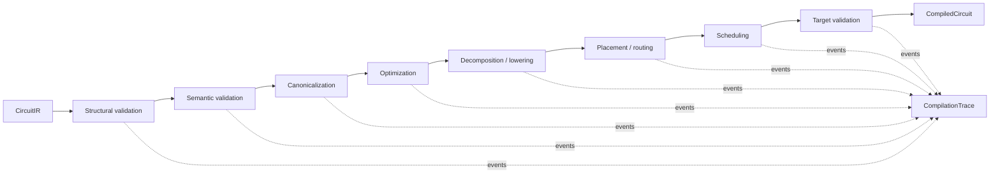

# Compiler Pipeline

> Status: Proposed  
> Evidence basis: Qiskit, pytket, LLVM/MLIR, Catalyst, CUDA-Q, and PyZX sources in
> the [source register](../research/source-register.md)

## Compiler contract

**Decision:** QCore compilation is an explicit deterministic pipeline over
immutable CircuitIR. A pass declares prerequisites, provided analyses, preserved
analyses, invalidated analyses, supported features, target requirements, and a
stable implementation version. Every pass produces trace evidence even when it
makes no change.



**Decision:** Phase 1 implements the full stage skeleton but only the passes whose
scope is marked `P1` below. Empty stages still appear in the pipeline identity so
future additions do not silently reorder existing work.

## Pass catalogue and staging

| Stage | Pass or analysis | Scope | Dependencies | Preserves / invalidates |
|---|---|---|---|---|
| Parse/import | OpenQASM/adaptor parse | Existing edge | Input grammar/version | Produces source map; outside compiler proper |
| Structural validation | Schema, IDs, bounds, arity, finite values | **P1** | None | Preserves all; emits diagnostics |
| Semantic validation | Terminal measurement and feature checks | **P1** | Structural validity | Preserves all; emits capability needs |
| Type checking | Classical/symbolic expression types | Future | Structured IR | Preserves structure; may provide type map |
| Canonicalization | Gate/parameter/name normalization | **P1** | Structural validity | Invalidates semantic hash, operation counts |
| Constant folding | Symbolic/classical evaluation | Future | Type map | Invalidates expression/use analyses |
| Dead-operation elimination | Remove provably irrelevant operations | Phase 2 | Liveness/measurement cone | Invalidates depth, counts, liveness |
| Inverse cancellation | Adjacent safe inverse pairs | **P1** | Gate semantics | Invalidates depth, counts; preserves topology needs |
| Rotation merging | Adjacent compatible rotations with numeric angles | **P1** | Gate semantics, commutation boundary | Invalidates depth/counts; preserves qubit set |
| Commutation analysis | Establish safe local reorder relations | Phase 2 analysis | Gate semantics | Analysis only |
| Measurement deferral | Transform only when equivalence is proven | Future | Control/dataflow proof | Invalidates control/liveness; high-risk opt-in |
| Decomposition | Expand unsupported gates into target basis | Phase 2 | Target gate set, synthesis registry | Invalidates depth/counts/commutation |
| Gate synthesis | Approximate/construct target operations | Future/integrated | Tolerance, target, algorithm identity | Invalidates numeric error/resource metrics |
| Qubit reuse | Recycle qubits after proven lifetime end | Future | Liveness/control flow | Invalidates mapping and all topology analyses |
| Ancilla management | Allocate/release clean/dirty ancillas | Future | Synthesis and liveness contracts | Invalidates qubit set, mapping, depth |
| Placement | Logical-to-physical initial map | Phase 2 | Target topology, interaction graph | Provides layout; invalidates physical depth |
| Routing/SWAP insertion | Satisfy connectivity | Phase 2 | Layout, topology | Invalidates depth/counts/layout details |
| Native lowering | Rebase into target gates | Phase 2 | Target, decomposition registry | Invalidates operation metrics |
| Scheduling | Assign start/duration under timing constraints | Future | Durations, dependencies, target timing | Produces schedule; invalidates on structural change |
| Noise-aware optimization | Optimize estimated objective | Future research | Calibrations/noise snapshot | Potentially nondeterministic; must record objective/snapshot |
| Resource estimation | Counts, depth, two-qubit gates, estimated memory | **P1 analysis** | Canonical IR; target optional | Analysis only |
| Target validation | Supported features, gate set, limits | **P1** | Immutable `Target` | Preserves all; blocks execution on error |
| Pulse lowering | Circuit to calibrated schedule | Future adapter | Calibration ownership/profile | Separate program type; not a CircuitIR mutation |
| Result post-processing | Provider/result normalization | Runtime, not compiler | Backend result contract | Outside compiler trace |

## Proposed pass interfaces

The following Python is **Proposed**:

```python
@dataclass(frozen=True)
class PassInfo:
    id: str
    version: str
    requires: frozenset[str]
    provides: frozenset[str]
    preserves: frozenset[str]
    deterministic: bool = True


@dataclass(frozen=True)
class PassContext:
    target: Target
    options: CompileOptions
    analyses: AnalysisStore
    budget: CompilationBudget


@dataclass(frozen=True)
class PassResult:
    circuit: CircuitIR
    diagnostics: tuple[Diagnostic, ...]
    provenance: tuple[ProvenanceEvent, ...]
    metrics: PassMetrics


class CompilerPass(Protocol):
    info: PassInfo

    def run(self, circuit: CircuitIR, context: PassContext) -> PassResult: ...
```

**Decision:** A pass cannot mutate the input or analysis store. The manager
publishes new analyses after checking declared invalidation. Unexpected exceptions
are wrapped in a stable `QCORE-COMPILER-PASS-FAILED` diagnostic with the pass ID;
the original traceback is available only in debug output.

## Pipeline declaration

A pipeline is canonical data, not arbitrary callbacks:

```json
{
  "schema_version": "qplanck.pipeline.v0.1",
  "id": "default-o1",
  "passes": [
    {"id": "validate.structural", "version": "1"},
    {"id": "validate.semantic", "version": "1"},
    {"id": "canonicalize.static", "version": "1"},
    {"id": "opt.inverse-cancel", "version": "1"},
    {"id": "opt.rotation-merge", "version": "1"},
    {"id": "analyze.resources", "version": "1"},
    {"id": "validate.target", "version": "1"}
  ]
}
```

- **Decision:** Dependency resolution is deterministic and fails on cycles,
  missing providers, duplicate IDs, or ambiguous versions.
- **Decision:** Explicit user order is preserved when dependencies permit it.
- **Decision:** No pass is loaded by importing every installed entry point.
- **Decision:** Pipeline and pass versions contribute to the compiled artifact and
  manifest identity.

## Optimization levels

| Level | Contract | Phase 1 |
|---|---|---|
| `0` | Validate, canonicalize representation, collect metrics; no semantic optimization | Implement |
| `1` | Add local exact rewrites with cheap deterministic proofs | Default and implement |
| `2` | Add target-aware decomposition and routing with deterministic heuristics | Reserve for Phase 2 |
| `3` | Potentially expensive search/synthesis under explicit time/error budget | Future, opt-in |

**Decision:** Levels are documented pipeline aliases, not vague quality promises.
Users may supply an explicit pipeline. Changing an alias's pass list requires a
minor release and release-note entry during v0.x.

## Analyses

Initial analysis keys are versioned and typed:

- `structure.operation_counts/v1`
- `structure.depth/v1`
- `structure.interaction_graph/v1`
- `target.requirements/v1`
- `target.conformance/v1`
- `simulator.memory_estimate/v1`
- `trace.payload_estimate/v1`

**Decision:** Analysis results are cached by `(semantic_ir_hash, analysis_id,
analysis_version, target_hash, relevant_options_hash)`. Pass timing is never part
of a semantic cache key.

## Compilation trace and circuit diff

`CompilationTrace` is distinct from the existing `ExecutionTrace`. Its proposed
event includes:

```json
{
  "index": 3,
  "pass": {"id": "opt.inverse-cancel", "version": "1"},
  "input_ir": "sha256:...",
  "output_ir": "sha256:...",
  "changed": true,
  "provenance": [
    {"rule": "self-inverse-adjacent", "removed": ["op0003", "op0004"]}
  ],
  "metrics_before": {"operations": 4, "depth": 3},
  "metrics_after": {"operations": 2, "depth": 2},
  "diagnostics": [],
  "duration_ns": 21870
}
```

- **Decision:** Duration is observational and excluded from canonical trace hash.
- **Decision:** Diffs are structural and ID-aware; rendering is a separate concern.
- **Decision:** Trace modes are `off`, `summary`, and `full`, each with byte/event
  budgets. Budget exhaustion emits a diagnostic and preserves the compiled result
  unless full tracing was explicitly required.
- **Decision:** Replay validates all pass/pipeline/target identities before running.
  "Rollback" means selecting a retained prior immutable artifact, not reversing an
  arbitrary pass.

## Determinism

1. Sort sets/maps before iteration when order affects output.
2. Use stable tie-breakers based on canonical node/target IDs.
3. Require explicit seeds for randomized research passes and record them.
4. Reject dependence on wall clock, process ID, object hash randomization, or
   unordered plugin discovery.
5. Define floating-point normalization and tolerances per pass.
6. Run deterministic fixtures across Python 3.11-3.13 and all CI operating systems.

**Open Question:** Some future synthesis/search algorithms may benefit from
nondeterminism. They must be explicitly experimental and cannot participate in the
default reproducible pipeline until a seed/replay contract exists.

## Custom pass safety

**Verified:** Python plugins execute with the host process's authority.

**Decision:** Phase 1 custom passes are trusted, explicitly instantiated objects.
Entry-point discovery may list metadata but never executes a plugin. Untrusted
passes require a future subprocess or sandbox protocol with serialized inputs,
resource limits, no inherited credentials, and output revalidation.

## Testing strategy

- Unit tests for every rewrite precondition, positive case, negative case, and
  diagnostic code.
- Property tests for semantic equivalence, idempotence where promised, and no
  out-of-range references.
- Metamorphic tests such as compile-twice stability and inverse insertion/removal.
- Differential tests against matrix simulation and selected external compilers.
- Random-circuit invariant tests preserving state/probabilities within tolerance.
- Golden pipeline, diagnostic, provenance, and trace fixtures.
- Fuzz tests for pipeline declarations, pass failure containment, and budgets.
- Performance baselines for each pass with correctness gates before timing.

## Language allocation

| Component | Phase 1 language | Reason | Native trigger |
|---|---|---|---|
| Contracts, passes, runtime | Python | Existing package, accessibility, iteration, typed dataclasses | Published profile shows an unfixable material bottleneck |
| Reference simulation | Python + NumPy | Auditable matrix semantics and available browser NumPy | Never rewrite merely for speed; add adapter first |
| Browser execution | Python in Pyodide/Wasm | Reuses package and notebooks | Missing required package/latency within defined lab workload |
| Advanced compiler/native simulator | External adapters | Mature ecosystems already exist | Accepted ownership and benchmark case |
| Future QIR/MLIR integration | Likely native bindings plus Python facade | Ecosystem toolchains are native | Dynamic/multi-level feature gate accepted |
