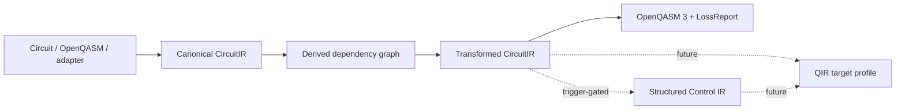

# Intermediate Representation Strategy

> Status: Proposed  
> Governing decision: [RFC 0003](../../rfcs/0003-intermediate-representation.md)

## Decision

**Decision:** Retain a small, immutable, versioned custom `CircuitIR` for source
mapping, validation, deterministic serialization, compiler provenance, and visual
traces. Treat OpenQASM 3 as exchange and QIR as a future lowering target. Use
derived graphs for analysis, not a second serialized source of truth. Defer an
MLIR dialect until accepted structured-control or multi-level lowering use cases
justify its infrastructure.

**Verified:** The audited alpha already serializes `qplanck.ir.v0.1`
deterministically and uses it in circuit, QASM, Qiskit, simulator, and trace paths.
See the [current-alpha audit](../research/current-alpha-audit.md).

## Options analysis

| Option | Source/debug fidelity | Static circuits | Dynamic control | Hardware lowering | Infrastructure cost | Decision |
|---|---:|---:|---:|---:|---:|---|
| Current custom sequence IR | High for QCore | High | Low | Medium | Low | **Retain and evolve** |
| OpenQASM 3 AST as sole IR | High for QASM | High | High | Medium | Medium | Exchange/parse only; QCore provenance would be external annotations |
| Graph/DAG as sole IR | Medium | High | Low | High | Medium | Derived analysis view; awkward source order and serialization |
| QIR/LLVM as sole IR | Low at circuit source | Medium | High | High | High | Future lowering target |
| New QCore MLIR dialect | High if fully built | High | High | High | Very high | Defer behind explicit trigger |
| Hybrid multi-level persistent IRs | Potentially high | High | High | High | Very high | Add levels only when semantics require them |

**Inference:** A custom circuit schema is not justified by gate representation;
OpenQASM and existing SDKs already do that. It is justified only by QCore-owned
operation identities, source spans, diagnostics, provenance, and compatibility.
Every custom field must serve one of those needs.

## Representation boundaries



- **Decision:** `CircuitIR` is the source of truth for Phase 1 compilation.
- **Decision:** Dependency graphs, commutation sets, liveness, and depth are
  analyses keyed by the immutable IR hash.
- **Decision:** External import preserves source spans and origin metadata where
  possible; export returns a `LossReport` even when it is empty.
- **Decision:** No decoder executes plugins, evaluates user code, imports Python
  modules, or contacts a backend.

## Phase 1 semantic scope

| Feature | Phase 1 representation | Validation rule |
|---|---|---|
| Qubits | Dense indices `0..n-1` | At least one; every reference in range |
| Classical bits | Dense indices derived from terminal measurement declarations | Mapping is unique under the accepted measurement RFC decision |
| Gates | Existing static gate subset | Known arity, finite numeric parameters, distinct controlled operands |
| Parameters | Numeric values only at compile/run time | NaN and infinity rejected; named placeholders remain non-executable |
| Measurements | Terminal `MeasurementSpec` entries | No later quantum operations; result-key semantics are explicit |
| Metadata | Namespaced, validated JSON values | Size/depth limits; no semantic fields hidden in metadata |
| Source mapping | Optional URI plus byte/line span | Span must be internally consistent; URI is data, never fetched automatically |
| Provenance | External to semantic node payload, referenced by stable node IDs | Provenance cannot alter execution semantics |

**Open Question:** Phase 1 must decide whether duplicate qubit measurements or
multiple qubits mapped to one classical bit are invalid or use last-write
semantics. The recommendation is to reject both until dynamic classical semantics
exist.

## Proposed schema evolution

**Decision:** The existing `qplanck.ir.v0.1` reader remains available throughout
v0.x. Phase 1 may emit `qplanck.ir.v0.2` only after an accepted schema RFC,
committed fixtures, and a deterministic v0.1-to-v0.2 migrator. Unknown schema
versions fail closed with a coded diagnostic.

The following JSON is **Proposed** and illustrates the intended v0.2 shape:

```json
{
  "schema_version": "qplanck.ir.v0.2",
  "circuit_id": "sha256:5c5c...",
  "name": "bell",
  "qubit_count": 2,
  "classical_bit_count": 2,
  "features": ["static", "terminal_measurement"],
  "operations": [
    {
      "id": "op0001",
      "name": "h",
      "qubits": [0],
      "params": [],
      "source": {"uri": "examples/bell.py", "line": 4, "column": 1},
      "metadata": {}
    },
    {
      "id": "op0002",
      "name": "cx",
      "qubits": [0, 1],
      "params": [],
      "source": {"uri": "examples/bell.py", "line": 5, "column": 1},
      "metadata": {}
    }
  ],
  "measurements": [
    {"id": "m0001", "qubit": 0, "cbit": 0, "metadata": {}},
    {"id": "m0002", "qubit": 1, "cbit": 1, "metadata": {}}
  ],
  "metadata": {"qplanck.education.lesson": "bell-01"}
}
```

## Identity and canonicalization

- **Decision:** User-visible node IDs are deterministic within a canonical circuit,
  using ordered prefixes such as `op0001`; random UUIDs are prohibited in
  canonical output.
- **Decision:** `circuit_id` is computed after canonical serialization and excludes
  the `circuit_id` field itself. Source URIs may be included or excluded through a
  declared hash profile; the default semantic hash excludes local absolute paths.
- **Decision:** Object keys are lexically sorted, arrays retain semantic order,
  finite floats use one canonical representation, and Unicode normalization is
  specified before stable-schema release.
- **Decision:** Metadata keys owned by QCore use `qplanck.*`; third parties use a
  reverse-domain or registered namespace. Unnamespaced semantic metadata is
  rejected from stable schemas.
- **Open Question:** RFC follow-up must select a canonical JSON profile and define
  negative zero handling before IDs become public compatibility contracts.

## Source maps and provenance

**Decision:** Source maps answer "where did this node originate?" Provenance
answers "which pass produced or removed it, and why?" They are separate:

```text
SourceRef(node_id -> uri/span/external node)
ProvenanceEvent(pass_id, input_ids, output_ids, rule, diagnostic_ids)
```

A pass may preserve an ID only when the operation's semantics and source identity
are unchanged. Replaced nodes receive new deterministic IDs and link to their
inputs in `CompilationTrace`.

## Future feature triggers

| Trigger | Required architectural response |
|---|---|
| Mid-circuit measurement plus conditional gate accepted into roadmap | Add typed classical values and ordered control-flow semantics; do not extend terminal lists ad hoc |
| Loops/functions with source-level replay | Evaluate structured high-level IR and OpenQASM AST preservation |
| QIR runtime or provider requires lowering | Add target-profile-aware QIR emitter and QIR conformance tests |
| Pulse timing/calibration becomes product scope | Add a separate scheduled/pulse program type and calibration ownership model |
| Two independent lowerings require common dialect infrastructure | Re-evaluate MLIR with a benchmarked prototype and maintenance budget |
| Observable/variational workflows accepted | Add typed observable and parameter-binding contracts, not metadata blobs |

## Interchange policy

- **Decision:** Importers return `CircuitIR` plus diagnostics and preserved origin
  data. Unsupported constructs produce a structured error with source span.
- **Decision:** Exporters return text/object plus `LossReport`; lossy export is
  opt-in and enumerates every dropped or approximated feature.
- **Decision:** Round-trip tests distinguish semantic equivalence from byte or AST
  identity.
- **Decision:** OpenQASM 3 remains the preferred human-readable exchange language.
- **Decision:** QIR imports are deferred; unknown runtime calls or target profiles
  must never be guessed.

## Validation and tests

1. JSON Schema validates shape before dataclass construction.
2. Semantic validation checks indices, arity, finite values, feature consistency,
   measurement rules, and budget limits.
3. Canonical fixtures test exact bytes for every supported schema version.
4. Property tests generate valid/invalid circuits and round trips.
5. Fuzzers cover JSON/QASM depth, length, numeric edge cases, and decoder errors.
6. Differential tests compare imported/exported semantics with independent SDKs.
7. Migration tests prove idempotence and preserve declared semantic hashes.

## Explicit non-goals

**Decision:** CircuitIR v0.x is not a universal quantum language, optimizer
exchange standard, provider calibration schema, arbitrary Python object store, or
replacement for OpenQASM/QIR/MLIR.
