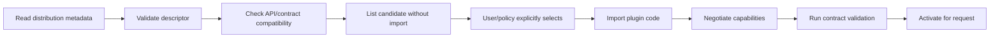

# Plugin and Extension System

> Status: Proposed  
> Phase 1 posture: explicit trusted objects; metadata discovery only

## Goals

**Decision:** Extensions add capabilities without making core depend on every
provider, simulator, compiler algorithm, serializer, visualizer, lesson, or agent
transport. The plugin boundary must preserve typed contracts, version compatibility,
capability negotiation, deterministic selection, and failure containment.

**Verified:** Python entry points are package discovery metadata, not a security
boundary. Importing an entry point executes code with the host Python process's
permissions.

## Extension categories

| Category | Contract | Proposed entry-point group | Phase 1 |
|---|---|---|---|
| Compiler pass | `CompilerPass` + `PassInfo` | `qplanck.compiler_passes` | Explicit object only |
| Backend | `Backend` + immutable `Target` | `qplanck.backends` | Local/mock built in; metadata listing only |
| Simulator | Backend with simulator result capabilities | `qplanck.simulators` | No external official plugin |
| Serializer/importer/exporter | Typed format descriptor and loss report | `qplanck.serializers` | Existing QASM built in |
| Visualizer | Artifact-to-renderer contract | `qplanck.visualizers` | ASCII built in |
| Noise model | Versioned model serializer and capability | `qplanck.noise_models` | Deferred |
| Education module | Lesson manifest and asset resolver | `qplanck.education` | Static bundled lessons only |
| Benchmark suite | Workload/correctness/metric definitions | `qplanck.benchmarks` | Built-in baseline first |
| Agent tool | JSON-schema tool descriptor and policy | `qplanck.agent_tools` | Dedicated package later |

## Package naming and ownership

- Official adapters use distributions such as `qplanck-qiskit` and import modules
  under `qplanck_qiskit`, not under core's private namespace.
- Community packages must not imply QPlanck endorsement; recommended names are
  `vendor-qplanck-*` or `qplanck-community-*` subject to the trademark policy.
- A distribution may provide several plugin instances, each with a globally unique
  reverse-domain ID such as `org.example.backend.simulator`.
- Core-owned IDs use `qplanck.*`.

## Plugin descriptor

The following descriptor is **Proposed** and is read as static metadata before any
plugin module is imported:

```json
{
  "schema_version": "qplanck.plugin.v0.1",
  "id": "org.example.backend.demo",
  "kind": "backend",
  "distribution": "example-qplanck-demo",
  "distribution_version": "2.1.0",
  "entry_point": "example_qplanck_demo:plugin",
  "qplanck_api": ">=0.2,<0.4",
  "contract": "qplanck.backend/v1",
  "capabilities": ["static_circuit", "counts"],
  "trust": "in_process",
  "homepage": "https://example.org/plugin"
}
```

**Decision:** Installed distribution metadata is not trusted merely because it is
signed by a package index or present on disk. Descriptor fields are validated and
displayed before load; they do not override local policy.

## Discovery and activation



1. Discovery is side-effect-free metadata enumeration.
2. Candidate order is lexical by plugin ID and version; duplicate IDs are errors.
3. Activation requires an explicit ID or a deterministic policy configured by the
   user. "Best available" implicit selection is prohibited.
4. Import occurs only after compatibility and trust checks.
5. The plugin object is validated against its contract before use.
6. Actual capabilities come from the validated object/target, not descriptor claims.

## Compatibility

- Plugin contracts have independent schema/API versions.
- QCore publishes a compatibility range and contract test package for each stable
  extension type.
- A plugin declares both QCore API range and provider/dependency range.
- Unknown major contract versions fail closed.
- Deprecations follow at least one minor-release warning period during v0.x unless
  security or correctness requires immediate rejection.
- Adapter test results should be published against a support matrix; absence from
  the matrix means unverified, not incompatible.

## Capability negotiation

**Decision:** Capability selection is intersection plus explicit diagnostics:

```text
program requirements
  intersect target capabilities
  intersect plugin implementation capabilities
  intersect execution policy/budget
  -> accepted plan or complete ordered diagnostics
```

No plugin may silently decompose, approximate, drop metadata, refresh a target, or
switch providers to make a request fit. Such actions require compiler provenance
or explicit user policy.

## Trust and isolation

| Trust level | Execution | Suitable uses | Policy |
|---|---|---|---|
| Built-in | Same process | Core passes, local/mock backends | Reviewed and released with QCore |
| Trusted in-process | Same process | Explicitly installed adapters/passes | Full host authority; clear warning and allowlist |
| Restricted subprocess | Separate process, serialized contract | Future third-party passes/serializers | No inherited secrets; CPU/memory/time/filesystem/network policy |
| Remote sandbox | Isolated service or microVM | Future untrusted notebooks/plugins | Authenticated protocol, quotas, artifact validation, audit logs |

**Decision:** Phase 1 supports the first two levels only and accurately describes
them as trusted code. It does not advertise Python import controls as sandboxing.

## Failure containment

- Wrap plugin exceptions in a stable diagnostic retaining plugin ID/version and an
  opaque failure reference; redact paths/secrets from default messages.
- Revalidate every returned IR, target, result, and manifest before core accepts it.
- Enforce request budgets outside plugin code where possible.
- Disable a plugin instance after contract corruption; do not silently retry with a
  different plugin.
- Never let a failed optional plugin prevent `qplanck doctor` from checking core;
  report it in a separate plugin section.
- Provider adapter retry behavior is explicit, idempotency-aware, bounded, and
  recorded in job metadata.

## Plugin safety by category

| Kind | Principal threat | Required control |
|---|---|---|
| Compiler pass | Semantic corruption or nondeterminism | Output validation, invariants, provenance, seed policy |
| Backend | Credential/data theft or unintended spend | Separate package, secret resolver, dry run, limits, audit |
| Serializer | Parser denial of service or code execution | Size/depth limits, no object hooks, fuzzing |
| Visualizer | XSS or unsafe artifact links | Escaping, content security policy, no active HTML by default |
| Education module | Untrusted notebook code | Signed/pinned assets and browser/sandbox budget |
| Agent tool | Prompt-injected side effects | Permission class, schema validation, confirmation policy |

## Phase 1 deliverables

1. Publish interface protocols and contract tests for compiler passes and backends.
2. Implement static plugin descriptor validation and `qplanck doctor --plugins`
   reporting without importing candidates.
3. Accept explicitly instantiated custom passes in a compile pipeline.
4. Keep provider and third-party auto-discovery disabled.
5. Document package naming, support ranges, and security limitations.

**Open Question:** Entry-point groups should not be activated until at least one
real external integration proves the descriptor and compatibility model. Premature
registration would freeze unused contracts.
