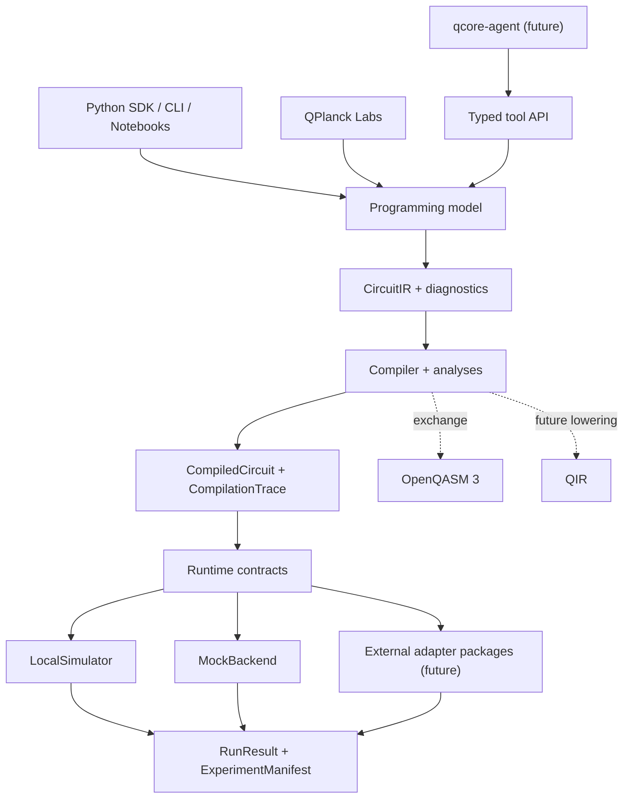
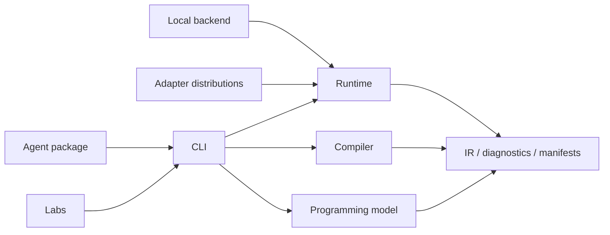
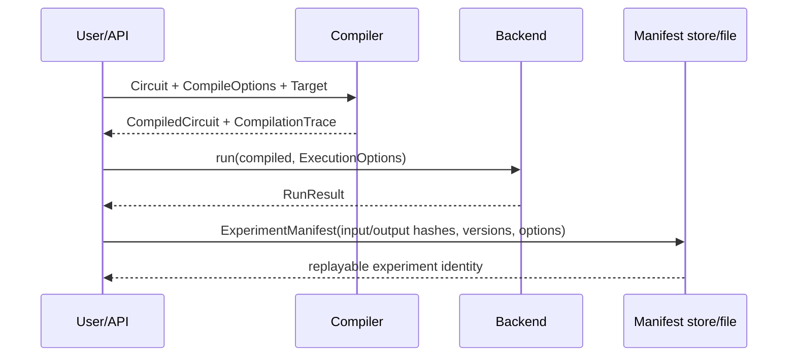

# QCore System Overview

> Status: Proposed architecture  
> Evidence cut-off: 2026-07-14

## Architectural correction to the master model

**Inference:** The master prompt's layered model correctly separates programming,
IR, compilation, execution, and backends, but it places platform services under
the SDK as though they were required foundations. Registry, authentication,
telemetry, storage, and scheduling are hosted-product concerns. Making them core
dependencies would weaken local use and expand the security boundary.

**Decision:** QCore uses a local dependency core with optional adapters and product
surfaces around it:



## Dependency rule

**Decision:** Dependencies point inward toward data contracts. Core modules never
import Labs, agents, provider adapters, or hosted services.



No reverse edge is allowed. Serialization modules may depend on contract types but
must not execute compilers, plugins, or backends while decoding.

## Subsystem contracts

| Subsystem | Responsibilities | Public interfaces | Dependencies / extensions | Failure and security boundary | Phase 1 test strategy |
|---|---|---|---|---|---|
| Programming model | Construct circuits, registers, operations, parameters, measurements; preserve source intent | `Circuit`, existing gate builders; **Proposed** `Circuit.compile` | IR and diagnostics; importer extensions | Reject invalid indices/types early; no backend/network calls | Unit, property, fluent compatibility, source-span tests |
| Contract layer | Immutable canonical data, schema versions, diagnostics, manifests, hashes | `CircuitIR`, **Proposed** `Diagnostic`, `ExperimentManifest` | JSON/schema utilities only | Size/depth limits; no code execution during decode | Golden fixtures, fuzzing, round trips, migration tests |
| Compiler | Validate, analyze, transform, lower, record provenance | **Proposed** `Compiler`, `Pass`, `CompiledCircuit`, `CompilationTrace` | Contract layer; explicitly registered trusted passes | Budget/time limits; deterministic ordering; plugin failures contained | Invariants, differential tests, pass replay, random circuits |
| Runtime | Capability negotiation, options, lifecycle, result normalization | **Proposed** `Backend`, `Target`, `Job`, `ExecutionOptions`, `RunResult` | Contracts; backends implement interfaces | No credentials in core; validate target and budgets before run | Shared backend contract suite, state-machine tests |
| Local backend | Execute supported static circuits and sample results | `Simulator` compatibility; **Proposed** `LocalSimulator` | NumPy reference engine | Memory/trace/shot budgets, numeric validation | Matrix oracles, metamorphic, seeded reproducibility |
| Mock backend | Exercise lifecycle and deterministic failures | **Proposed** `MockBackend`, `Job` | Runtime only | No network; scripted states and errors | Contract and state transition tests |
| Serialization/interchange | Import/export supported external syntax with loss reports | Existing QASM/Qiskit methods; future serializers | Optional parsers/adapters | Parse untrusted data under strict limits; no implicit plugin loading | Corpus, fuzz, differential, lossy-boundary tests |
| CLI | Human and machine entry points | Existing `qplanck`; future exact `qcore` facade | Public APIs only | Safe paths, atomic writes, no secret echo; ownership check | Process-level smoke and JSON contract tests |
| Labs | Static notebooks, trace views, lesson assets | Browser UI, notebook APIs | Built wheel, schemas, static assets | Browser origin/package limits; no hosted secrets | Playwright, notebook, Wasm memory, artifact parity |
| Agent package | Bounded local tools and policy | JSON-schema tools; future MCP server | Public APIs/CLI, never compiler internals | Prompt injection, permissions, budgets, audit logs | Schema, adversarial input, policy, dry-run tests |
| Provider adapters | Translate capabilities, jobs, results | Separate packages implementing `Backend` | Provider SDK and runtime contracts | Credentials, network, retries, raw payload isolation | Mock provider, contract, sandbox integration tests |

## Data flow and artifact identity



**Decision:** Canonical artifacts use content hashes over schema-versioned JSON.
Hashes identify content, not trust. Manifests record both canonical hashes and the
software/target context required to interpret them.

## Terminology

| Term | Definition |
|---|---|
| `Circuit` | User-facing builder preserving source intent and compatibility behavior. |
| `CircuitIR` | Immutable, versioned static-circuit representation used for validation, traces, and exchange mapping. |
| `Target` | Immutable capability and constraint snapshot used for compilation and preflight validation. |
| `Pass` | Deterministic transformation or analysis unit with declared requirements and effects. |
| `CompiledCircuit` | CircuitIR plus target/pipeline identity and compilation metadata; not necessarily machine code. |
| `CompilationTrace` | Pass-by-pass provenance, diagnostics, diffs, and metrics. Distinct from state evolution. |
| `ExecutionTrace` | Runtime state/probability snapshots for a supported local execution. |
| `Backend` | Capability-bearing execution implementation with synchronous and asynchronous lifecycle contracts. |
| `Job` | Handle for asynchronous execution state, cancellation, and result retrieval. |
| `RunResult` | Normalized counts/probabilities/metadata plus namespaced backend data. |
| `ExperimentManifest` | Reproducibility record tying source, compile, target, execution, environment, and result identities together. |
| Adapter | Separately versioned integration translating an external SDK/provider while preserving capability and loss information. |

## Proposed public flow

The following example is **Proposed** and is not implemented in Phase 0:

```python
from qplanck import Circuit
from qplanck.backends import LocalSimulator

circuit = Circuit(2, name="bell")
circuit.h(0).cx(0, 1).measure_all()

backend = LocalSimulator()
compiled = circuit.compile(
    target=backend.target,
    optimization_level=1,
    trace=True,
)
result = backend.run(compiled, shots=1_000, seed=7)

print(result.counts)
print(compiled.trace.summary())
print(result.manifest.to_json(indent=2))
```

**Decision:** `Backend.run(...) -> RunResult` is synchronous.
`Backend.submit(...) -> Job` is asynchronous. Existing
`Simulator("statevector").run(...)` remains supported throughout v0.x and delegates
to `LocalSimulator` after implementation.

## Proposed package map

No package move occurs during Phase 0. The staged target is:

```text
qcore/
├── src/qplanck/                 # distribution and implementation namespace
│   ├── circuit.py               # stable programming model
│   ├── ir/                      # schemas, canonicalization, migrations
│   ├── diagnostics/             # coded machine/human diagnostics
│   ├── compiler/                # passes, analyses, pipeline, trace
│   ├── runtime/                 # backend, target, job, options, manifest
│   ├── backends/                # local and mock only
│   ├── interchange/             # OpenQASM and compatibility shims
│   └── cli/                     # qplanck and future facade implementation
├── packages/
│   ├── qplanck-qiskit/          # future extracted adapter
│   └── qcore-agent/             # future optional agent tools
├── labs/                        # static JupyterLite build and notebooks
├── schemas/                     # published JSON schemas and fixtures
├── benchmarks/                  # pinned reproducible benchmark suites
├── docs/
├── examples/
├── rfcs/
└── tests/
```

**Decision:** Existing `src/qplanck/qiskit_adapter.py` remains in place until an
adapter extraction can preserve imports and pass compatibility tests. Repository
organization follows demonstrated ownership boundaries; it does not pre-create
empty native crates or service directories.

## Performance model

- **Verified:** The reference statevector requires approximately
  `16 * 2**qubits` bytes before temporary arrays and trace copies.
- **Decision:** Preflight computes conservative memory and payload estimates and
  rejects work over configured budgets.
- **Decision:** Compiler phases report wall time and structural metrics, but
  deterministic outputs may not depend on timing.
- **Decision:** Native code is admitted only after public benchmarks identify a
  material bottleneck that algorithm/data-structure work in Python cannot solve.
- **Open Question:** Numeric byte stability across BLAS/architectures may not be
  realistic for all future simulators; manifests must record tolerances and backend
  identity rather than promise bitwise floating-point equality universally.

## Long-term boundaries

**Decision:** Dynamic circuits, observables, noise channels, pulse programs, and
hybrid kernels become distinct typed program capabilities. They are not smuggled
into generic metadata. Multi-level IR is introduced only when at least one
accepted use case cannot be represented without semantic loss.
