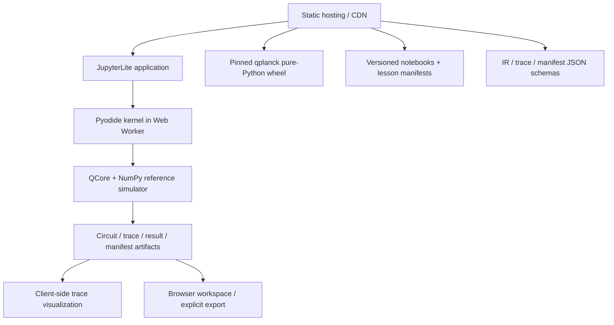

# QPlanck Labs Architecture

> Status: Proposed  
> First implementation: static JupyterLite/Pyodide feasibility slice

## Recommendation

**Decision:** Build the first QPlanck Labs as a static JupyterLite site running
QCore in Pyodide, with bundled version-pinned notebooks and a client-side trace
viewer. Do not begin with managed containers, terminals, QPU credentials,
collaboration, billing, or a multi-tenant control plane.

**Verified:** [JupyterLite](https://jupyterlite.readthedocs.io/en/stable/) can be
served as static assets without an application server, while
[Pyodide](https://pyodide.org/en/stable/) runs CPython and NumPy in WebAssembly.
Package loading is constrained by browser/Wasm wheel compatibility. qBraid Lab,
by contrast, documents managed browser environments and compute resources. See
the [qBraid analysis](../research/qbraid-analysis.md).

**Inference:** The static route is the lowest-complexity way to validate whether
QCore's teaching, trace, and reproducibility experience is compelling before
QPlanck accepts hosted-execution security and operations costs.

## Options assessment

| Model | Native package compatibility | Operations burden | Isolation burden | Offline/static use | Decision |
|---|---:|---:|---:|---:|---|
| JupyterLite + Pyodide | Medium | Low | Low server-side; browser origin still matters | High | **Select first** |
| Browser-native custom editor/runtime | Medium | Medium | Low server-side | High | Defer until notebook workflow proves UI needs |
| JupyterLab with remote kernels | High | High | High | Low | Defer |
| Remote containers on Kubernetes | High | Very high | Very high | None | Reject initially |
| Firecracker/microVM workers | High | Very high | Stronger primitive, still substantial platform work | None | Research for future untrusted execution |
| Cloudflare Sandboxes | High within platform constraints | Medium/high and platform-specific | Managed boundary requiring review | None | Future feasibility option |
| Hybrid local browser + opt-in remote | High overall | High | High on remote path | Medium | Likely long-term shape, not MVP |

## Static architecture



**Decision:** The browser and local Python SDK consume identical published schemas.
Labs-specific lesson state, hints, and progress remain outside CircuitIR and
`ExperimentManifest`.

## MVP experience

The first usable screen is the notebook/workbench, not a marketing landing page.
The feasibility slice includes:

1. A bundled Bell-state notebook using the released QCore wheel.
2. Circuit text/ASCII output and a compact state/probability view.
3. A compiler pass timeline with operation counts, depth, diagnostics, and an
   operation-level before/after diff.
4. Seeded local execution with visible basis-order metadata.
5. Export/import of CircuitIR, compilation trace, execution trace, and experiment
   manifest JSON.
6. One Academy exercise validated by mathematical invariants.
7. Browser memory/trace budgets with clear coded errors.
8. Version and environment details accessible from `doctor` output.

**Decision:** The slice has no terminal, arbitrary pip index, Git credentials,
shared workspace, user account, remote kernel, or hardware submission.

## Trace viewer contract

- Render only schema-validated trace artifacts.
- Display the exact compiler pipeline/pass version and target hash.
- Preserve operation IDs across circuit, diff, diagnostics, and state steps.
- Show truncation/budget diagnostics rather than silently omitting steps.
- Escape all labels/source text and use a strict Content Security Policy.
- Never execute HTML, JavaScript, notebook output, or plugin renderers embedded in
  trace metadata.
- Keep large statevectors out of the DOM; use bounded summaries and explicit
  drill-down for accepted sizes.

**Inference:** A pass explorer is more strategically aligned than reproducing a
general cloud dashboard. The supplied qBraid screenshots are product evidence,
not a visual specification for QPlanck Labs.

## Academy contract

Each course release pins:

```yaml
lesson_schema: qplanck.lesson.v0.1
lesson_id: academy.bell.01
qplanck: ">=0.2.0a1,<0.3"
notebook_sha256: "..."
wheel_sha256: "..."
features: [static, terminal_measurement, execution_trace]
budget:
  max_qubits: 8
  max_shots: 10000
  max_trace_bytes: 4000000
checks:
  - probability_support: ["00", "11"]
  - probability_sum_close: {absolute_tolerance: 1.0e-12}
```

This YAML is **Proposed**. Checks target invariants rather than one sampled output.
Hidden grading logic is signed/versioned separately and is never embedded as an
instruction for an AI agent.

## Packaging and deployment

1. Build the normal `qplanck` wheel in CI.
2. Verify it contains no native extension and installs through `micropip` in the
   pinned Pyodide/JupyterLite versions.
3. Generate a lock/asset manifest with hashes for wheel, notebooks, schemas, and
   front-end bundle.
4. Run notebook and browser smoke tests before publishing immutable versioned
   assets.
5. Publish a short-lived preview for review, then a versioned static release.
6. Keep `latest` as a redirect/pointer; course links resolve to immutable releases.

**Open Question:** CDN/host selection remains operational and can begin with
GitHub Pages if artifact size, headers, and preview requirements fit. Static
architecture must remain portable.

## Browser constraints and mitigations

| Constraint | Control | Gate |
|---|---|---|
| Wasm package incompatibility | Pure-Python core, pinned NumPy/Pyodide, build smoke test | Wheel installs and examples run in clean browser |
| Main-thread blocking | Execute Python in Web Worker; budget compilation/simulation | UI remains responsive under max lesson workload |
| Browser memory | Conservative qubit/state/trace estimates and hard limits | Over-limit work fails before allocation |
| Persistent storage variability | Explicit artifact export/import and schema hashes | Lesson does not depend on durable browser storage |
| Network/CORS | Bundle required assets; no arbitrary package URLs | Core lesson works after initial static load |
| XSS/notebook output | Sanitize/escape, CSP, disable untrusted active outputs | Adversarial trace/notebook corpus passes |
| Supply chain | Pinned hashes, locked toolchain, provenance/SBOM | Build refuses unpinned release assets |
| Mobile layout | Responsive notebook/trace controls with bounded panels | Playwright checks desktop and mobile viewports |

## Evolution gates

| Capability | Evidence required before implementation |
|---|---|
| Custom circuit editor | Notebook usability study identifies repeated circuit-authoring friction |
| Remote kernels | Required course/research package cannot run in Pyodide and demand justifies operations |
| User accounts/progress sync | Academy identity and privacy model accepted |
| Collaborative workspaces | Concrete collaboration workflow and conflict/storage model accepted |
| Hardware submission | Runtime adapters, credential broker, spend controls, and incident response accepted |
| Hosted arbitrary code | Threat model, isolation prototype, abuse controls, quotas, and operating budget accepted |

## Verification plan

- Run bundled notebooks from a clean static build.
- Compare browser and local canonical IR/trace/manifest fixtures.
- Use Playwright at desktop and mobile viewports for load, edit, run, inspect,
  export, import, and budget-error flows.
- Inspect worker/main-thread behavior and browser memory at defined limits.
- Validate Content Security Policy and adversarial labels/notebook outputs.
- Check every course asset hash and dependency version during build.
