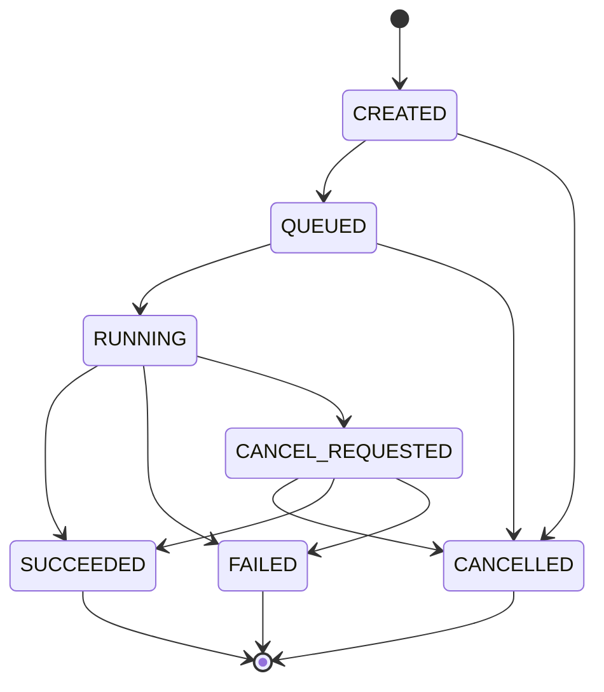

# Runtime and Backend Architecture

> Status: Proposed  
> Governing decision: [RFC 0004](../../rfcs/0004-backend-interface.md)

## Scope

**Decision:** The runtime coordinates validated compiled programs and execution
implementations. It owns capability negotiation, options, lifecycle, normalized
results, diagnostics, and reproducibility metadata. It does not own provider
credentials, compilation algorithms, notebook isolation, or cloud scheduling.

**Decision:** Phase 1 implements `LocalSimulator` and `MockBackend` only. Existing
`Simulator("statevector")` remains supported throughout v0.x and becomes a
compatibility facade over `LocalSimulator`.

## Core types

| Type | Responsibility | Identity / mutability | Phase 1 |
|---|---|---|---|
| `Backend` | Capabilities and synchronous/asynchronous execution contract | Implementation ID + version; object may hold local resources | Protocol + two implementations |
| `Target` | Immutable snapshot of gates, topology, limits, timing, and feature support | Canonical content hash | Implement static circuit subset |
| `LocalSimulator` | Execute supported compiled circuits in-process | Backend ID `qplanck.local-statevector` | Implement behind current simulator |
| `MockBackend` | Script deterministic lifecycle, delays, failures, and result fixtures | Test scenario identity | Implement |
| `Job` | Observe/cancel asynchronous execution and retrieve result | Backend-scoped immutable job ID | Implement for mock; local may complete immediately |
| `JobStatus` | Stable lifecycle state plus provider details | Enum + namespaced detail | Implement |
| `RunResult` | Counts, samples, probabilities/state references, metadata, diagnostics | Immutable canonical result where possible | Evolve current type compatibly |
| `ExecutionOptions` | Shots, seed, limits, trace, backend options | Immutable and canonical | Implement |
| `ExperimentManifest` | Link source, compile, target, execution, environment, and result artifacts | Versioned canonical JSON | Implement |
| `Session` | Group provider workloads under a provider-defined lifetime | Separate optional protocol | Reserve; do not implement |
| `Sampler` / `Estimator` | Workload-specific primitive interfaces | Optional capability | Reserve; do not force onto all backends |
| `Experiment` | User-level collection of source, compile, execution, and annotations | Manifest-backed higher-level object | Phase 2 |

## Proposed interfaces

The following Python is **Proposed**:

```python
class Backend(Protocol):
    @property
    def backend_id(self) -> str: ...

    @property
    def target(self) -> Target: ...

    def run(
        self,
        program: CompiledCircuit,
        *,
        options: ExecutionOptions | None = None,
    ) -> RunResult: ...

    def submit(
        self,
        program: CompiledCircuit,
        *,
        options: ExecutionOptions | None = None,
    ) -> Job: ...


class Job(Protocol):
    @property
    def id(self) -> str: ...

    def status(self) -> JobStatus: ...

    def cancel(self) -> bool: ...

    def result(self, *, timeout: float | None = None) -> RunResult: ...
```

**Decision:** `Backend.run` is a blocking convenience with one return type. It may
internally call `submit().result()`, but its diagnostics and manifest semantics
must match direct submission. `Backend.submit` never returns a raw provider SDK
job.

## Target capability model

`Target` fields are explicit and extensible:

| Category | Stable fields | Extension behavior |
|---|---|---|
| Identity | target ID, provider, model, snapshot time/version | Raw provider identifier preserved |
| Qubits | count, logical/physical addressing | Provider labels may be namespaced |
| Connectivity | directed/undirected edges, hyperedges if supported | Unknown topology represented as unknown, not all-to-all |
| Instructions | names, arity, parameters, conditions, per-location availability | Provider instructions retain namespace |
| Dynamic behavior | mid-circuit measurement, conditionals, loops, reset | Granular feature enum, not one `dynamic=True` flag |
| Measurement | basis, multiplexing, terminal/mid-circuit, classical formats | Unsupported combinations are constraints |
| Timing | duration, alignment, granularity, acquisition constraints | Values reference units and calibration snapshot |
| Pulse | availability, channel/frame/calibration profile | Separate pulse-program capability |
| Limits | shots, circuits/job, depth, parameters, payload bytes | Unknown is distinct from unlimited |
| Noise/calibration | timestamped references and summary metrics | Raw calibration stays external or namespaced |
| Results | counts, memory, statevector, expectation, raw payload | Backend declares each result capability |
| Runtime | queue estimate, sessions, cancellation, streaming | Volatile fields are non-semantic snapshots |
| Authentication | required mechanism identifier | No secret values in `Target` |

**Decision:** Target preflight returns all detectable incompatibilities in stable
order. Compilation must use the exact target hash later recorded in the manifest.
A remote adapter may refresh a target only before compilation or after explicit
user consent, never silently between compile and run.

## Execution options

The following shape is **Proposed**:

```python
ExecutionOptions(
    shots=1_000,
    seed=7,
    trace="summary",
    timeout_seconds=30.0,
    max_memory_bytes=256_000_000,
    max_result_bytes=16_000_000,
    backend_options={"vendor.example.option": "value"},
)
```

- `shots`: non-negative integer or `None`; zero-shot semantics must be resolved
  before stable release.
- `seed`: deterministic local seed; remote providers may reject or report it as
  unsupported rather than pretend to honor it.
- `trace`: `off`, `summary`, or `full`, subject to budget.
- resource values: hard client-side limits when enforceable and declared requests
  otherwise.
- `backend_options`: JSON-only, namespaced, validated by the backend, and echoed
  into the manifest with secret fields redacted.

## Measurement and result semantics

**Decision:** Phase 1 adopts these proposed semantics before runtime extraction:

1. Terminal measurements map selected qubits to a dense, unique classical range.
2. `RunResult.counts` and shot memory use `c[m-1]...c[0]` when explicit
   measurements exist.
3. `RunResult.probabilities` remains the full quantum basis distribution in
   `q[n-1]...q[0]` order for the reference simulator.
4. With no measurement declarations, the legacy `Simulator.run(shots=N)` performs
   an implicit all-qubit observation to preserve v0.x behavior; the manifest marks
   it `implicit_measure_all=true`.
5. Sparse classical indices, duplicate destinations, and repeated source qubits
   are rejected in Phase 1.
6. A provider result that cannot be normalized losslessly retains a typed raw
   payload reference and emits a loss diagnostic.

**Open Question:** This measurement proposal requires explicit approval because
the current implementation samples full qubit keys without applying mappings.

## Job state machine



- **Decision:** States are monotonic. Provider-specific intermediate states are
  retained in detail but map to one stable state.
- **Decision:** `cancel()` reports whether the request was accepted, not whether
  cancellation is guaranteed.
- **Decision:** `result(timeout=...)` timing out does not cancel the job.
- **Decision:** Repeated `result()` calls return equivalent normalized results or
  the same stable failure diagnostic.

## RunResult

The existing fields remain. Proposed additions are compatible:

```text
RunResult
├── counts: Mapping[str, int]
├── measurements: tuple[str, ...]
├── probabilities: Mapping[str, float]
├── metadata: Mapping[str, JsonValue]
├── diagnostics: tuple[Diagnostic, ...]       # proposed
├── execution_trace: ExecutionTrace | None    # current `trace` alias retained
├── manifest: ExperimentManifest              # proposed
└── raw_result: ExternalArtifactRef | None     # proposed, adapter-only
```

**Decision:** Results are immutable after construction. Large statevectors and raw
provider payloads may be content-addressed external artifacts rather than embedded
in JSON. Counts must sum to accepted shots unless a documented provider condition
such as discarded shots is represented explicitly.

## Experiment manifest

The proposed manifest records:

| Section | Required content |
|---|---|
| Source | Circuit semantic hash, schema, optional source artifact hash |
| Compilation | compiled hash, pipeline/pass versions, target hash, options, trace hash |
| Execution | backend ID/version, options, seed handling, job ID, start/end timestamps |
| Environment | qplanck version, Python/platform, dependency lock hash, adapter versions |
| Results | result hash, shot accounting, numeric tolerance profile, diagnostics |
| Integrity | manifest schema, canonical hash, optional signature reference |

**Decision:** Secrets, access tokens, full environment variables, home-directory
paths, and provider credentials are never serialized. A manifest is evidence of
inputs, not proof that a remote provider executed honestly. Optional signatures
may be added later without changing semantic result content.

## LocalSimulator

- **Purpose:** auditable exact reference behavior for small static circuits.
- **Supported:** current gate subset, terminal measurements, `complex128`, seeded
  sampling, statevector/probability result, budgeted execution trace.
- **Preflight:** finite parameters, target conformance, estimated state/temporary
  memory, shots, trace bytes, result bytes.
- **Failure:** coded diagnostic before allocation where possible; no partial result
  after numeric or invariant failure.
- **Parallelism:** single-process deterministic baseline; no implicit threading
  promise beyond NumPy internals.
- **Precision:** `complex128` only in Phase 1.
- **Compatibility:** current `Simulator.statevector()` and `.probabilities()` map
  directly to equivalent local backend methods.

## MockBackend

**Decision:** Mock scenarios declaratively specify target, state transitions,
delays under a fake clock, result fixture, cancellation behavior, and failure
diagnostic. Tests must never sleep or depend on wall-clock scheduling.

```python
# Proposed
backend = MockBackend.scenario(
    target=Target.testing(qubits=5),
    states=[JobStatus.QUEUED, JobStatus.RUNNING, JobStatus.SUCCEEDED],
    result=RunResult.testing(counts={"00": 5, "11": 5}),
)
```

## Sessions, Sampler, and Estimator

- **Decision:** `Session` is an optional backend capability with explicit lifetime,
  close behavior, and provider options. Core code cannot assume it exists.
- **Decision:** `Sampler` and `Estimator` are future workload protocols that may be
  exposed by a backend. They do not replace `Backend.run` for ordinary compiled
  circuits and are not emulated when semantics would differ.
- **Decision:** Provider primitives preserve their version and provider-specific
  options; normalized outputs record precision/error metadata.

## Provider adapter rules

1. Ship as separate distributions such as `qplanck-ibm` or `qplanck-braket`.
2. Depend on a bounded QCore runtime API range and a bounded provider SDK range.
3. Never accept credentials in circuit/IR/manifest objects.
4. Use provider-native secure credential resolution and redact diagnostics.
5. Preserve target snapshots and raw job/result identifiers.
6. Translate errors to stable diagnostics without discarding provider codes.
7. Implement the shared backend contract suite plus adapter-specific integration
   tests against mocks; live tests are opt-in and budgeted.
8. Expose provider features through typed capabilities or namespaced options, not
   silent approximations.

## Initial API specification

All examples below are **Proposed** unless explicitly marked current. Future-scope
examples demonstrate boundaries; they are not Phase 1 commitments.

### Bell state: Phase 1

```python
from qplanck import Circuit
from qplanck.backends import LocalSimulator

circuit = Circuit(2).h(0).cx(0, 1).measure_all()
backend = LocalSimulator()
compiled = circuit.compile(target=backend.target, trace=True)
result = backend.run(compiled, options=ExecutionOptions(shots=1_000, seed=7))
```

### GHZ state: Phase 1

```python
circuit = Circuit(4).h(0).cx(0, 1).cx(1, 2).cx(2, 3).measure_all()
result = LocalSimulator().run(circuit.compile(), shots=2_000, seed=11)
```

The direct `shots` and `seed` keywords are a proposed ergonomic shorthand for an
`ExecutionOptions` instance.

### Grover search: Phase 2 library example

```python
oracle = Circuit(2).cz(0, 1)
circuit = grover_search(qubits=2, oracle=oracle).measure_all()
result = LocalSimulator().run(circuit.compile(), shots=1_000, seed=5)
```

`grover_search` belongs in an examples/algorithms package, not compiler core.

### Variational algorithm: future parameters and observables

```python
theta = Parameter("theta")
ansatz = Circuit(2).ry(theta, 0).cx(0, 1)
energy = Estimator(backend).run(
    ansatz,
    observable=PauliSum("ZI + IZ"),
    bindings={theta: 0.25},
)
```

This requires accepted parameter binding and observable RFCs.

### Hamiltonian simulation: future typed program feature

```python
program = evolve(
    Hamiltonian.pauli("0.5 * XX + 0.5 * YY"),
    time=1.0,
    method="trotter",
    steps=20,
)
compiled = program.compile(target=backend.target, error_budget=1e-3)
```

Approximation method and error budget must appear in provenance.

### Dynamic circuit: future structured IR

```python
@qfunction
def teleport(message: Qubit, a: Qubit, b: Qubit):
    m0 = measure(message)
    m1 = measure(a)
    if m1:
        x(b)
    if m0:
        z(b)
```

This syntax is illustrative only. QCore will not encode it in Phase 1 metadata or
terminal measurements.

### Noise simulation: future external backend

```python
backend = AerBackend(method="density_matrix", noise_model=model)
result = backend.run(circuit.compile(target=backend.target), shots=10_000, seed=9)
```

Noise-model identity and serialization must be recorded in the manifest.

### Hardware execution: future adapter

```python
backend = IBMBackend.from_environment(target="ibm_example")
compiled = circuit.compile(target=backend.target)
job = backend.submit(compiled, shots=4_000)
result = job.result(timeout=900)
```

Credentials are resolved by the adapter and never appear in QCore artifacts.

### Compiler inspection: Phase 1

```python
compiled = circuit.compile(optimization_level=1, trace="full")
for event in compiled.trace.events:
    print(event.pass_id, event.metrics_before, event.metrics_after)
```

### Pulse experiment: future separate program type

```python
pulse_program = PulseProgram(target=backend.target)
pulse_program.play(channel="drive:q0", waveform=Gaussian(...))
pulse_program.acquire(qubit=0, memory_slot=0)
```

Pulse programs require calibration/timing ownership and are not lowered from
CircuitIR until a separate RFC is accepted.

## Verification

- Shared backend contract tests cover preflight, sync/async equivalence, state
  transitions, cancellation, timeout, shot accounting, diagnostics, and manifests.
- Local tests add matrix/differential correctness, numeric tolerances, resource
  rejection, seeded reproducibility, and bit-order fixtures.
- Mock tests enumerate every job transition and failure state using a fake clock.
- Adapter tests use recorded schemas/mocks and optional live smoke tests with strict
  spend and credential controls.
- Manifest replay tests run across Python 3.11-3.13 and supported operating systems.
