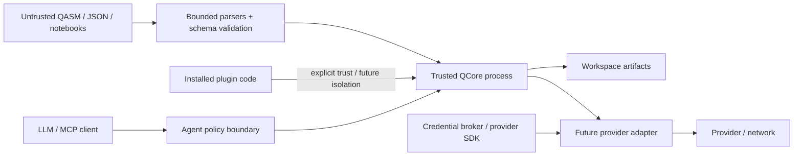

# QCore Initial Threat Model

> Status: Proposed Phase 0 baseline  
> Scope: local SDK, CLI, static Labs, future plugins/agents/adapters

## Security objectives

1. Untrusted circuit, QASM, JSON, trace, notebook, or result data must not execute
   code merely by being parsed, validated, rendered, or inspected.
2. Work must be rejected before disproportionate memory, CPU, trace, result, or
   remote-spend consumption where estimates are possible.
3. Credentials and sensitive environment data must not enter IR, diagnostics,
   manifests, traces, logs, or agent context.
4. Plugin/provider failures must not corrupt core artifacts or silently change
   semantics.
5. Reproducibility artifacts must identify inputs and versions without claiming
   more trust than their provenance supports.

## Assets

- Correct circuit, compiler, simulator, and result semantics.
- User source, notebooks, experiment artifacts, and unpublished research data.
- Provider credentials, cloud identities, and future spending authority.
- Developer workstation files and environment.
- Package/release integrity, schemas, documentation, and update channels.
- Audit logs and manifests used to reproduce or attribute experiments.
- Availability of local tools and any future hosted service.

## Actors

| Actor | Capability |
|---|---|
| Honest local user | Supplies malformed input accidentally; may overrun resources |
| Malicious artifact author | Controls QASM/JSON/notebook/trace strings and structure |
| Malicious plugin/adapter | Executes installed Python code with host authority |
| Compromised dependency/release | Executes during install/build/import or alters artifacts |
| Prompt-injection author | Embeds instructions in docs, code, results, or provider errors |
| Abusive remote user | Attempts compute exhaustion, job abuse, data extraction, or spend |
| Compromised provider/network | Returns malformed, stale, misleading, or oversized data |

## Trust boundaries

**Verified:** In the local Python model, core and explicitly loaded in-process
plugins share one operating-system trust boundary. Phase 1 must state this plainly.

## Risk register

Likelihood and impact are qualitative for the planned phase, not quantitative
probability claims.

| ID | Threat | Phase | Likelihood | Impact | Required control | Residual risk / gate |
|---|---|---|---|---|---|---|
| SEC-001 | QASM parser complexity or expression bomb consumes CPU/memory | 1 | Medium | High | Byte/token/nesting/numeric limits, restricted grammar, timeout where isolated, fuzzing | Hand parser remains narrow; official parser requires its own review |
| SEC-002 | Malformed IR/JSON triggers crash, type confusion, or oversized allocation | 1 | High | High | JSON Schema then semantic validation; depth/collection/value limits; no object hooks | Python parser allocation before validation needs an input-byte cap |
| SEC-003 | Statevector allocation exhausts memory | 1 | High | High | Conservative preflight bytes, hard backend budget, no allocation before approval | NumPy temporaries vary; estimate must include safety factor |
| SEC-004 | Trace/result payload exhausts memory/browser DOM | 1/Labs | High | High | Trace modes, event/byte budgets, external artifacts, bounded rendering | Full trace remains opt-in and rejected above budget |
| SEC-005 | Path traversal or unsafe overwrite in CLI artifact output | 1 | Medium | Medium | Explicit workspace/path policy, atomic create/replace semantics, no archive extraction | Local user retains authority over chosen paths |
| SEC-006 | Deserialization executes code | 1 | Low if design held | Critical | JSON-only stable formats, no pickle/eval/object hooks, decoders never import plugins | Numeric AST evaluator remains bounded and fuzzed |
| SEC-007 | Malicious compiler pass corrupts semantics | 1/2 | Medium | High | Explicit trusted load, output validation, invariants, provenance, differential tests | In-process trusted plugin can still compromise host/process |
| SEC-008 | Malicious backend/adapter steals credentials or data | 4 | Medium | Critical | Separate package, allowlist, credential broker/provider SDK, redaction, future isolation | Third-party Python adapter remains fully trusted if in-process |
| SEC-009 | Credential leaks into logs/manifests/errors | 4 | Medium | Critical | Opaque credential references, structured redaction, secret-pattern tests, no env dumps | Provider errors may echo secrets; sanitize and retain private raw refs cautiously |
| SEC-010 | Dependency/package compromise | All | Medium | Critical | Pinned release builds, hashes, minimal dependencies, review, SBOM, provenance, dependabot, isolated build | Package index and CI account compromise remain external risks |
| SEC-011 | Future notebook executes arbitrary code on hosted infrastructure | Labs hosted | High | Critical | Browser-only first; later microVM/sandbox, no secrets, egress policy, quotas, ephemeral storage | No hosted arbitrary code until separate security review |
| SEC-012 | Browser trace/notebook output causes XSS | Labs | Medium | High | Escaping/sanitization, CSP, no active metadata renderers, adversarial Playwright tests | Third-party Jupyter extensions require separate review |
| SEC-013 | Agent follows prompt injection from artifact/docs/results | 6 | High | High | Treat text as data, external policy authorization, typed tools, no secrets, permission/budget checks | Model output is never a security decision |
| SEC-014 | Agent submits costly or destructive remote job | 6 | Medium | Critical | Submission disabled initially; explicit confirmation, spend/shot limits, idempotency, audit, allowlisted target | Provider may accept before uncertain network response; reconcile job IDs |
| SEC-015 | Provider returns stale/malformed capability or result | 4 | Medium | High | Timestamp/hash target snapshot, schema validation, raw reference, compile-run consistency, diagnostics | Provider truth cannot be independently guaranteed |
| SEC-016 | Retry duplicates remote job | 4 | Medium | High | Provider idempotency key where supported, no blind retries, uncertain state surfaced | Some providers lack idempotency; require manual reconciliation |
| SEC-017 | Reproducibility manifest leaks paths/system data | 1 | Medium | Medium | Allowlisted environment fields, normalized relative source refs, explicit redaction | User metadata can still contain sensitive text; warn and scan exports |
| SEC-018 | Manifest/hash is mistaken for authenticity | 1 | Medium | Medium | Documentation states content hashes are not signatures; optional signing later | Social/process misuse remains possible |
| SEC-019 | Algorithmic/compiler bug produces plausible wrong result | All | Medium | Critical | Independent oracles, invariants, randomized/differential tests, versioned diagnostics, accepted limitations | Quantum correctness cannot be secured solely through access controls |
| SEC-020 | Name collision imports unrelated `qcore` package | 1/facade | High if facade attempted | High | Keep `qplanck`; future `doctor` verifies distribution owner/path/version before facade | User environments may be compromised already; fail closed and explain remediation |

## Phase 1 mandatory controls

- Input byte, JSON depth/node, circuit operation/qubit, shot, memory, trace, and
  result limits with coded diagnostics.
- Finite-number validation; reject NaN/infinity in semantic artifacts.
- No pickle, YAML object construction, Python eval, dynamic import from data, or
  automatic plugin activation.
- Canonical schema fixtures and fuzz targets for QASM/JSON decoders.
- Resource estimates before simulator allocation.
- Manifest allowlist/redaction tests.
- Dependency lock for releases, generated SBOM, artifact hashes, and protected
  release credentials.
- Security reporting through the existing `SECURITY.md` private channel.
- `doctor` reports package origin and later blocks unsafe `qcore` facade ownership.

## Future hosted-Labs controls

**Decision:** A hosted execution milestone requires a separate design review
covering tenant identity, microVM/container escape, kernel/network policy, file and
object storage, secret brokering, image provenance, quotas, abuse detection,
telemetry privacy, deletion, incident response, backups, and cost containment.
Kubernetes or a sandbox vendor alone does not satisfy this gate.

## Security verification

| Control area | Verification |
|---|---|
| Parsers | Coverage-guided fuzzing, malicious corpus, memory/time limit tests |
| Simulator budgets | Boundary/property tests and measured peak-memory calibration |
| Compiler correctness | Matrix/differential/metamorphic tests and pass invariants |
| Serialization | Round trip, unknown-field/version rejection, no-code-execution tests |
| Plugins | Descriptor fuzzing, explicit-load tests, corrupted-output revalidation |
| Secrets | Synthetic secret canaries through errors/logs/manifests/agent outputs |
| Browser | CSP checks, XSS corpus, worker/memory tests, dependency audit |
| Supply chain | Reproducible build metadata, SBOM scan, signed/provenance-aware release workflow |
| Agents | Adversarial prompt corpus, policy bypass tests, permission and budget matrix |
| Providers | Mocked retries/idempotency/status mapping; budgeted live smoke tests |

## Accepted Phase 1 risks

- **Accepted:** Explicitly loaded Python plugins have full process authority. The UI
  and docs must say "trusted in-process," and auto-load remains disabled.
- **Accepted:** The NumPy reference simulator is not hardened for hostile shared
  multi-tenant execution. It is protected by local limits only.
- **Accepted:** Content hashes establish identity, not authenticity.
- **Accepted:** No provider credentials or remote submissions exist in Phase 1,
  removing those risks rather than pretending to solve them.

## Review triggers

Re-run this threat model before enabling any remote backend, hosted kernel,
third-party automatic plugin load, agent network tool, arbitrary notebook package,
new serialization format, native extension, or public artifact-sharing service.
