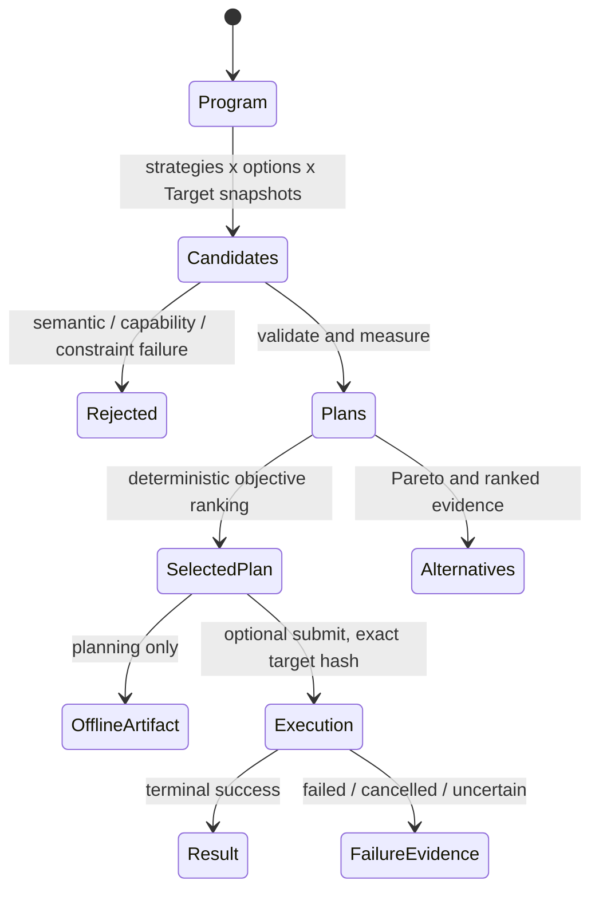

# QCore Planner Product Specification v0.1

> Status: Repository companion for the product and software milestone
> Implementation status: Not implied by this document
> Package-version note: this is planner specification `v0.1`, not the current
> `qplanck` package version (`0.3.0a1` in the repository at the time this
> document was created).

The exact [QCore Master Specification](QCORE_MASTER_SPECIFICATION.md) is the
governing product/build specification. This shorter companion organizes
repository-local requirements; the master report prevails wherever they differ.

This companion defines the first evidence-backed, multi-strategy execution
planner milestone for QCore. It turns the [product thesis](thesis.md) into
testable requirements. It does not declare a requirement implemented merely
because an API shape or code path appears below. Current public wording remains
governed by the [claim matrix](claims.md), the
[SDK standards contract](sdk-standards.md), accepted RFCs, source, and tests.

## Normative language

The words **MUST**, **MUST NOT**, **REQUIRED**, **SHOULD**, **SHOULD NOT**, and
**MAY** are normative. "Conceptual" examples illustrate the intended workflow
and are not promises that those imports or methods currently exist.

## Product North Star and milestone boundary

| Layer | Meaning | Status in this document |
|---|---|---|
| **Product North Star** | Adaptive performance portability across changing compilers, providers, devices, calibrations, and objectives. | Directional; not an acceptance claim. |
| **Planner v0.1** | Deterministic, explainable comparison of multiple compilation strategies against immutable IBM target snapshots, with reproducibility evidence. | Normative scope below. |
| **Later roadmap** | Closed-loop execution feedback, deeper native compilation, hybrid orchestration, and fault-tolerant/QEC planning. | Non-normative for v0.1. |

QCore v0.1 MUST be useful as an offline planner without credentials or a paid
hardware run. Optional execution MUST derive from the exact selected Plan and
MUST NOT silently re-plan against a newer target.

## Goals

QCore v0.1 MUST:

1. accept Qiskit input and provide OpenQASM 3 as a first-class frontend
   contract for the documented supported subset;
2. normalize supported inputs into a versioned QCore Program/IR without routing
   through an unrelated interchange format;
3. evaluate multiple compiler strategies and exact option sets against one or
   more accessible, immutable IBM Target snapshots;
4. reject semantically invalid or target-incompatible candidates before ranking;
5. report at least two-qubit gate count, circuit depth, compiler-inserted SWAP
   count, and an explicitly named estimated-error metric;
6. apply Objective constraints, weights, metric directions, tolerances, and
   missing-evidence policy deterministically;
7. retain candidate and rejection evidence, identify Pareto alternatives, select
   one Plan deterministically, and explain its trade-offs;
8. emit a complete reproducibility/provenance manifest; and
9. keep offline planning distinct from optional provider submission and result
   collection.

## Core domain model

All canonical artifacts MUST carry an independent schema version. Canonical
content hashes MUST include the schema version and semantic content, use a
documented canonical serialization, and exclude secrets, ephemeral object
addresses, wall-clock durations, and other observational implementation details.
A versioned artifact MUST NOT be reinterpreted under a different schema without
an explicit migration.

| Type | Responsibility | Stable identity | Principal invariants |
|---|---|---|---|
| `Program` | Portable normalized quantum intent plus frontend/source provenance and capability requirements. | `program_hash` over canonical normalized IR; original `input_hash` retained separately. | Immutable; semantically validated for its declared subset; no provider SDK objects; losses and assumptions explicit. |
| `Target` | One provider-neutral capability and evidence snapshot of an execution destination. | Stable target name plus immutable `target_snapshot_id` and `target_hash`. | Immutable; timestamped; declared and observed evidence separated; unknown distinct from unsupported/unlimited; no credentials. |
| `Objective` | User definition of valid and preferable plans. | `objective_hash` over its versioned metrics, directions, constraints, weights, scaling, tolerances, and unknown policy. | Immutable; deterministic; all units and minimization/maximization directions explicit; no hidden weights. |
| `Plan` | Frozen, valid candidate binding a transformed artifact and compiler strategy to one Target and Objective. | `plan_hash` over all semantic planning inputs and outputs. | References exact Program, Target, Objective, compiler/options/seed, metrics, score/rank, rationale, assumptions, and provenance; estimates are not guarantees. |
| `Execution` | Submitted or active run derived from exactly one frozen Plan. | Stable QCore `execution_id`; namespaced provider job reference recorded separately. | Plan never changes; lifecycle events append monotonically; provider objects and credentials do not cross the boundary. |
| `Result` | Immutable normalized outputs and reproducibility links for an Execution. | `result_hash` over canonical normalized output plus referenced artifact hashes. | References exactly one Execution and its Plan; raw provider data is optional and isolated; normalization and loss are explicit. |

### Program

A Program MUST retain:

- normalized IR and IR schema version;
- canonical program hash and original input hash;
- frontend/parser identity and version;
- source maps or operation provenance sufficient to explain transformations;
- declared features and target capability requirements; and
- diagnostics, conversion losses, and accepted assumptions.

Frontend-specific metadata MAY be namespaced, but it MUST NOT affect semantics
unless its meaning is versioned and validated. Unsupported constructs MUST fail
closed rather than be guessed, silently dropped, or approximated.

### Target

A Target snapshot MUST be provider-neutral at the core boundary and MUST be
immutable once used for planning. It MUST be able to represent, with partial or
unknown fields where necessary:

- provider and device identity without embedding a provider SDK object;
- qubit count and topology, including directionality;
- native operations/instruction set and per-location instruction support;
- qubit and instruction properties;
- timing, alignment, duration, and scheduling information;
- error, calibration, and other observed evidence with source and timestamp;
- resource limits and semantic constraints;
- dynamic-circuit, reset, measurement, parameter, pulse, runtime, and result
  capabilities where known;
- provenance, capture timestamp, schema version, snapshot identifier, and
  canonical hash.

Declared capabilities and observed/calibrated evidence MUST be stored as
different concepts. A missing error rate MUST remain unknown; it MUST NOT become
zero. A missing limit MUST remain unknown; it MUST NOT become unlimited. A
refresh produces a new snapshot unless the semantic snapshot content is
identical under the versioned hashing rules.

Planning and execution MUST use the same `target_hash`. Snapshot drift MUST stop
submission and require explicit re-planning or a user-authorized, recorded
exception that produces a new Plan.

### Objective

An Objective MUST define:

- hard constraints and their units;
- ordered metrics, minimization/maximization direction, and weights;
- the normalization or scaling rule used before weighted scoring;
- tolerances and deterministic comparison rules;
- policy for missing metrics or incomplete target evidence; and
- a deterministic tie-break policy.

The default missing-evidence policy MUST fail closed for a hard constraint and
for any weighted metric required to compare candidates. A deliberately permissive
policy MAY retain an unknown candidate, but its penalty and assumption MUST be
visible in the score and rationale.

### Plan

A valid Plan MUST identify:

- source `program_hash` and transformed artifact hash;
- compiler strategy/plugin identity and version;
- exact compiler options, pass configuration, seed, and toolchain versions;
- immutable `target_snapshot_id`, `target_hash`, and capture timestamp;
- `objective_hash`, constraints, weights, and scoring policy;
- correctness and target-validation evidence;
- all measured and estimated metrics, with units and model versions;
- score, rank, Pareto status, selection or alternative status;
- human- and machine-readable rationale;
- assumptions, warnings, and provenance links; and
- canonical `plan_hash`.

A Plan MUST be frozen before execution. It MUST NOT contain a mutable backend,
provider session, credential, or live provider SDK object. A candidate that fails
semantic validation, target validation, a hard constraint, or a required metric
MUST NOT be selected; its rejection evidence MUST still be retained in the
planning record.

### Execution

Execution begins only from a frozen Plan. Its lifecycle MUST distinguish at
least created, submitted/queued, running, succeeded, failed, cancelled, and
unknown/uncertain provider outcome where applicable. State transitions MUST be
monotonic in the QCore record. Cancellation describes the provider's accepted
request or observed terminal state; it MUST NOT claim that hardware stopped when
that is not known.

An Execution MUST retain its `execution_id`, `plan_hash`, backend/adapter identity
and version, redacted execution options, namespaced provider job reference,
timestamps, lifecycle evidence, and artifact references. Credentials MUST NOT be
accepted as serializable plan fields or recorded in manifests.

### Result

A Result MUST contain normalized outputs appropriate to the Program and backend,
diagnostics, normalization metadata, `execution_id`, `plan_hash`, `result_hash`,
timestamps, and reproducibility artifact links. It MAY reference a separately
stored raw provider artifact. Raw payloads MUST NOT be required by core consumers
and MUST be redacted or access-controlled independently.

### Lifecycle



The candidate set, rejected candidates, alternatives, and selected Plan MUST be
part of one reproducible planning decision. Re-running with identical semantic
inputs, versions, seeds, snapshots, and deterministic strategy implementations
MUST reproduce canonical planning artifacts.

## Frontend contract

### Qiskit

Qiskit circuit input is REQUIRED for v0.1. The frontend MUST record the Qiskit
version, direct conversion path, supported feature set, source-to-Program map,
and every loss or unsupported construct. QCore MUST NOT route Qiskit input
through Cirq or OpenQASM as an implicit conversion chain.

### OpenQASM 3

OpenQASM 3 is a first-class source and exchange contract. v0.1 MAY support a
documented subset rather than the complete language, but its grammar/profile and
limitations MUST be versioned. Unsupported control flow, custom definitions, or
other constructs MUST fail with stable diagnostics unless a loss-aware,
semantics-preserving conversion is explicitly defined.

Both frontends MUST normalize equivalent supported semantics to a QCore Program
without requiring provider credentials.

## Compiler-strategy portfolio

v0.1 MUST define a provider-neutral compiler-strategy boundary. A strategy
accepts a Program, exact options and seed, and a Target snapshot; it returns a
candidate transformed artifact plus provenance, metrics inputs, diagnostics, and
validation evidence.

The initial portfolio SHOULD make Qiskit, TKET, BQSKit, and QCore-native
passes/adapters available as independently versioned strategies. QCore MUST
orchestrate and compare them; v0.1 MUST NOT attempt to replace every compiler.
External integrations MUST be optional packages or dependency extras and MUST
not become imports required by the core model.

For each configured strategy, the planning record MUST say whether it was run,
unavailable, unsupported, timed out, failed validation, violated a constraint,
or produced a valid Plan. Missing optional tooling MUST NOT be silently omitted
from the candidate set. Compiler SDK objects MUST be converted into QCore-owned
artifacts at the strategy boundary.

At least two distinct, valid configured strategies MUST be compared in the v0.1
acceptance fixture. Identical aliases or option labels around the same artifact
do not satisfy this requirement unless they represent materially different,
recorded compiler pipelines.

## Planner behavior

For a Program, Objective, configured strategy portfolio, exact options, and one
or more Target snapshots, the planner MUST:

1. expand the declared candidate matrix of strategy, options, and Target;
2. normalize seeds, limits, and deterministic ordering;
3. compile or transform each available candidate;
4. validate Program semantics and target compatibility after transformation;
5. calculate required metrics under versioned definitions;
6. reject hard-constraint violations and required unknowns;
7. normalize metrics and compute the Objective score;
8. identify non-dominated Pareto alternatives;
9. rank valid Plans deterministically;
10. select one Plan and explain why it won, what it traded off, and why close or
    expected alternatives lost; and
11. preserve the complete decision and provenance manifest.

Tie-breaking MUST NOT depend on dictionary order, thread completion, process ID,
wall-clock duration, provider response order, or ambient CPU count. The exact
rank tuple and numeric representation MUST be versioned and recorded. The final
tie-break SHOULD use canonical `plan_hash` after all Objective-declared terms.

The planner MAY retain multiple Plans for user inspection. Automatic selection
MUST still produce exactly one selected Plan when at least one valid candidate
exists. If none exists, planning MUST fail with stable, ordered diagnostics and
the rejected-candidate evidence.

## Required metrics and estimation model

Every valid Plan MUST report these metrics on the final physical artifact:

| Metric | v0.1 definition |
|---|---|
| `two_qubit_gate_count` | Count of target-native operations acting on exactly two qubits. The report MUST also name which operation families were counted. |
| `circuit_depth` | Dependency-aware operation depth under a versioned scheduling convention. The convention MUST state whether measurements and zero-duration directives participate. |
| `inserted_swap_count` | Compiler-inserted routing SWAPs before basis expansion. User-authored semantic SWAPs MUST be reported separately. |
| `estimated_error` | `independent_instruction_error_v1`, defined below, or unknown with a reason. |

`independent_instruction_error_v1` is:

```text
estimated_error = 1 - product(1 - instruction_error_i)
```

for each executed physical instruction included by the model, using the
per-location error rate from the exact Target snapshot. Implementations SHOULD
accumulate in log space for numerical stability. The report MUST state whether
measurement errors are included; the default gate-quality metric excludes
readout and reports a separate readout estimate when requested.

This model assumes independent stochastic instruction failures. It does not
capture coherent error, crosstalk, drift after snapshot capture, correlated
noise, scheduling interactions, state dependence, queue effects, or application
success probability. It is a planning heuristic, **not a hardware-fidelity
guarantee**. If any included instruction lacks an applicable error rate, the
metric MUST be unknown unless the Objective names and records an explicit
imputation policy. Unknown MUST NOT be represented as zero.

Additional metrics such as duration, queue estimate, cost, or observed hardware
outcome MAY be plugins, but their units, evidence time, confidence, and model
versions MUST be explicit. Estimated and observed metrics MUST never share an
unqualified field.

## Objective scoring and explanation

Hard constraints MUST be evaluated before weighted ranking. Each weighted metric
MUST be transformed into a dimensionless loss by the normalization rule stored
in the Objective. The v0.1 score is the deterministic weighted sum of those
losses unless the Objective explicitly names another versioned scorer:

```text
score = sum(weight_m * normalized_loss_m)
```

Lower score is preferable for this default scorer. Weights, normalization
references, clipping, precision, tolerances, and treatment of unknowns MUST be
recorded. No ambient or server-side weight may influence selection.

The selection explanation MUST include:

- the winning target and compiler strategy;
- constraint pass/fail evidence;
- raw metrics, normalized losses, weights, score, and rank;
- decisive advantages and disadvantages;
- assumptions and unknown fields;
- at least the closest valid alternative, when one exists;
- Pareto alternatives retained; and
- rejected candidates grouped by stable reason codes.

Estimated metrics MUST be described as estimates. Explanations MUST NOT turn a
ranking into a claim that the Plan will outperform alternatives on hardware.

## IBM target and runtime boundary

The first target integration is IBM. An IBM adapter MUST discover or ingest
accessible device targets, normalize them into immutable QCore Target snapshots,
and preserve provider capability and calibration provenance without leaking IBM
SDK objects into core artifacts. Captured target fixtures MUST support offline
planning and regression tests.

The **offline planning profile is REQUIRED**. It ends with a selected frozen Plan
and manifest and requires no credential or billable action.

The **IBM execution profile is OPTIONAL for a v0.1 installation**. If advertised,
its separate provider adapter MUST implement discovery, snapshot refresh,
submission, polling, cancellation where the provider supports it, and result
normalization through QCore `Execution` and `Result` contracts. It MUST use the
ambient provider credential chain, revalidate `target_hash` before submission,
avoid blind retries, and prevent credentials and provider SDK objects from
entering manifests. A hardware job is not required to accept the offline planner
milestone.

Existing work on another provider, including the repository's separately gated
Braket pulse adapter, does not by itself satisfy the IBM planner requirements.

## Reproducibility and provenance manifest

Every planning decision MUST emit a canonical manifest containing at least:

- original input hash;
- normalized Program hash and IR schema version;
- frontend/parser identity and version;
- compiler, provider, and plugin identities and versions;
- exact compiler strategies, options, pass configuration, seeds, timeouts, and
  resource limits;
- Target snapshot identifiers, hashes, capture timestamps, capability sources,
  and calibration/evidence timestamps;
- Objective schema version, hash, metrics, directions, weights, scaling,
  constraints, tolerances, and unknown policy;
- the declared candidate matrix and the disposition of every candidate;
- transformed artifact hashes, validation evidence, metrics, scores, ranks,
  Pareto status, selection rationale, assumptions, and diagnostics;
- selected `plan_hash`;
- QCore, Python, Rust/native, OS, architecture, and relevant toolchain/library
  versions;
- planning start/end timestamps and deterministic-mode declaration;
- when executed: backend/adapter identity, redacted options, `execution_id`,
  namespaced provider job reference, lifecycle timestamps, and terminal status;
- result and raw-artifact hashes or references; and
- manifest schema version and canonical manifest hash.

The manifest MUST NOT contain credentials, tokens, raw environment variables,
account secrets, unredacted storage locations, or local absolute paths by
default. A hash identifies content; it does not establish trust. Signing and
attestation, when added, are separate concerns.

## Rust, Python, and IR constraints

Python is the ergonomic public surface. Rust owns performance-critical validated
models, hashing, graph/IR transformations, scoring/planning kernels, and
deterministic artifact generation where correctness tests and benchmarks justify
that boundary. PyO3 is the native bridge. Public Python contracts MUST NOT expose
PyO3 implementation objects or rely on panics for user diagnostics.

QCore MUST use progressive lowering and versioned, multi-level representations
when semantics require them. The architecture SHOULD remain compatible with
MLIR/LLVM concepts and QIR interchange/runtime boundaries. v0.1 does **not**
claim a complete MLIR implementation, a QCore MLIR dialect, universal QIR, or
support for every quantum program representation. The current IR decisions and
implemented subset remain governed by
[RFC 0003](../rfcs/0003-intermediate-representation.md),
[RFC 0005](../rfcs/0005-native-target-compiler.md), and the current
[architecture](architecture.md).

## `qcore-bench` evidence system

`qcore-bench` MUST be treated as a versioned evidence system for planner and
public performance claims. A comparable run MUST capture:

- workload corpus and semantic version;
- Program fixtures and correctness oracle;
- Target snapshots and hashes;
- Objective definitions and hashes;
- compiler strategy/plugin versions, exact options, seeds, and thread limits;
- warm-up, repetitions, timeout, resource limits, and execution order;
- hardware, OS, architecture, Python, Rust/native, and dependency environment;
- raw observations and failure/timeout records;
- correctness and semantic-equivalence checks before comparison; and
- machine-readable artifacts plus a human-readable report.

Reports MUST separate:

1. planning and compile-time runtime/memory;
2. output-quality metrics such as two-qubit count, depth, SWAPs, and estimated
   error; and
3. hardware-outcome metrics collected later under a separately defined
   experiment.

No named superiority or "beats" claim is permitted unless the relevant public,
equivalent-semantics benchmark and the repository's machine-checked claim gate
pass. Neutral benchmark results remain useful evidence.

## Engineering requirements

v0.1 implementations MUST follow these rules:

- correctness before optimisation;
- explainable decisions and rejections;
- provider-neutral core contracts;
- progressive lowering and versioned IRs;
- measurable execution advantage rather than untested intuition;
- modular, optional plugin boundaries;
- deterministic and reproducible behavior by default;
- explicit unknowns, limitations, and assumptions;
- fail-closed validation for semantic, capability, and snapshot mismatches; and
- evidence-gated implementation, provider, and performance claims.

Core planning MUST run without a network after Program, strategy packages, and
Target snapshots are present. Decoding an artifact MUST NOT execute plugins,
contact providers, or load credentials. Timeouts and unavailable strategies MUST
produce evidence; they MUST NOT disappear from the candidate record.

## Explicit v0.1 non-goals

v0.1 deliberately does not include:

- a giant IDE or hosted universal development environment;
- a full QPlanck Academy product;
- a universal proprietary quantum language;
- replacement of every existing compiler;
- opaque or unverified AI optimisation;
- universal provider, pulse, acquisition, dynamic-circuit, or QIR support;
- hybrid CPU/GPU/QPU orchestration;
- fault-tolerant or QEC planning; or
- any unsupported compiler, hardware, or superiority claim without
  `qcore-bench` evidence.

AI MAY later assist candidate generation or explanation, but an unverified AI
output MUST NOT authorize a transformation, override validation, change weights,
or serve as correctness evidence.

## Acceptance criteria

The planner v0.1 milestone is accepted only when all REQUIRED criteria below are
demonstrated by versioned fixtures, tests, and artifacts.

| ID | Required evidence |
|---|---|
| `P01` | A supported Qiskit circuit and equivalent supported OpenQASM input normalize deterministically to semantically equivalent versioned Programs with direct frontend provenance. |
| `P02` | At least one pinned IBM Target fixture contains topology, instruction support, partial calibration evidence, declared capabilities, provenance, timestamp, snapshot ID, and canonical hash; unknown fields survive round trip. |
| `P03` | A declared matrix compares at least two materially distinct valid compiler strategies and records unavailable, failed, timed-out, rejected, and valid dispositions without silent omission. |
| `P04` | Each valid Plan passes semantic and target-capability validation; injected semantic and snapshot mismatches fail closed with stable diagnostics. |
| `P05` | Two-qubit count, depth, inserted SWAP count, and `independent_instruction_error_v1` are reproducible and include definitions, model version, units, and unknown behavior. |
| `P06` | Hard constraints filter candidates; weights and normalization produce reproducible scores; identical inputs select the same `plan_hash` regardless of candidate completion order. |
| `P07` | The decision retains all candidate evidence and Pareto alternatives and explains the winner, closest valid alternative, trade-offs, assumptions, and rejection reasons. |
| `P08` | A canonical manifest contains every field required by this specification; secret-canary tests prove credentials, tokens, raw environment variables, and provider SDK objects are absent. |
| `P09` | Planning succeeds from pinned artifacts with networking disabled and without provider credentials or hardware submission. |
| `P10` | Replaying the same Program, Objective, strategies/options/seeds, Target snapshots, and toolchain reproduces canonical Program, Plan, candidate, and manifest identities within the documented compatibility policy. |
| `P11` | `qcore-bench` publishes raw artifacts for the acceptance workload, verifies semantic equivalence before timing, and reports compile-time and output quality separately without an unsupported superiority claim. |
| `P12` | If the optional IBM execution profile is advertised, shared lifecycle tests cover discovery, snapshot refresh, submission, polling, cancellation semantics, normalization, uncertain outcomes, and redaction; otherwise docs clearly label execution unavailable. |

Acceptance of `P01`-`P11` does not establish hardware advantage. Acceptance of
`P12` establishes adapter contract evidence only; a live execution or hardware
performance claim requires its own recorded gate.

## Concrete end-to-end use case

The acceptance use case is a Qiskit-authored circuit containing non-local
two-qubit interactions and terminal measurements. A researcher wants to minimize
estimated error subject to a maximum depth on accessible IBM devices.

QCore must:

1. normalize the Qiskit circuit into a Program and preserve the source map;
2. load pinned Target snapshots for the allowed IBM devices;
3. run the declared Qiskit, TKET, BQSKit, and QCore-native strategies that are
   installed, recording unavailable strategies explicitly;
4. validate each transformed circuit against its exact Target snapshot;
5. calculate the four required metrics;
6. reject plans over the depth constraint or with required unknown error data;
7. rank the valid plans, retain Pareto alternatives, and select one deterministically;
8. explain why the selected Plan won and where an alternative trades depth for
   estimated error;
9. write a manifest that can reproduce the decision offline; and
10. optionally submit only that frozen Plan after confirming the same Target
    snapshot hash.

### Conceptual API example — not currently guaranteed

```python
# CONCEPTUAL v0.1 API. These modules and signatures are specification examples,
# not a statement that the current qplanck package implements them.
from qplanck.planning import Objective, Planner, StrategyRef
from qplanck.frontends import program_from_qiskit
from qplanck_ibm import IBMTargetCatalog

program = program_from_qiskit(qiskit_circuit)
targets = IBMTargetCatalog.from_snapshot_files(["ibm_target_a.json", "ibm_target_b.json"])
objective = Objective.minimize(
    "estimated_error",
    constraints={"circuit_depth": {"max": 240}},
    tie_break=("two_qubit_gate_count", "plan_hash"),
    unknown_policy="reject_required",
)

decision = Planner(
    strategies=(
        StrategyRef("qiskit", seed=7),
        StrategyRef("tket", seed=7),
        StrategyRef("bqskit", seed=7),
        StrategyRef("qcore-native", seed=7),
    )
).plan(program, targets=targets, objective=objective)

print(decision.selected.plan_hash)
print(decision.selected.rationale)
print(decision.pareto_alternatives)
decision.manifest.write("planning-manifest.json")
```

Optional execution would accept `decision.selected`, revalidate its
`target_hash`, and return an `Execution`; it would not accept the original
mutable Qiskit object as authority and silently compile again.

## Current implementation and claim boundary

The repository's `qplanck 0.3.0a1` release-candidate documentation describes
existing circuit/IR, Rust compilation and routing, QIR, local/mock runtime, and
provider-adapter work. Some of those code paths remain behind release evidence
gates in the [claim matrix](claims.md). This planner specification adds a product
milestone centered on Objective, multi-strategy candidate generation, Plan
ranking, IBM target snapshots, and planner evidence. It MUST NOT be used to
retroactively label those planner capabilities implemented.

Before changing any status or README claim, maintainers and agents MUST inspect
the current source, tests, benchmark artifacts, accepted RFCs, and claim matrix.
Where this future-facing specification conflicts with verified implementation
status, verified evidence wins.

## Related decisions

- [QCore product thesis](thesis.md)
- [Current architecture](architecture.md)
- [System overview](architecture/qcore-overview.md)
- [Intermediate representation strategy](architecture/ir-strategy.md)
- [Compiler pipeline](architecture/compiler-pipeline.md)
- [Runtime and backends](architecture/runtime-and-backends.md)
- [Canonical strategic roadmap](roadmap.md)
- [Detailed historical roadmap](roadmap/qcore-roadmap.md)
- [RFC 0002: language, repository, and naming](../rfcs/0002-language-and-repository-strategy.md)
- [RFC 0003: intermediate representation](../rfcs/0003-intermediate-representation.md)
- [RFC 0004: backend and runtime](../rfcs/0004-backend-interface.md)
- [RFC 0005: native target compiler](../rfcs/0005-native-target-compiler.md)
