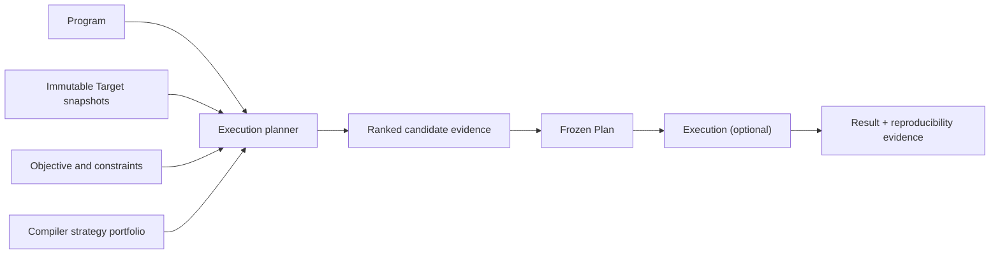

# QCore Product Thesis

> Status: Product North Star and decision frame
> This document describes what QCore is trying to become. It is not an
> implementation-status claim. The [QCore Master Specification](QCORE_MASTER_SPECIFICATION.md)
> governs product/build decisions; see the [v0.1 companion](spec-v0.1.md) and
> [claim matrix](claims.md) for repository status and allowed wording.

## Thesis

**QCore is the adaptive execution layer for quantum computing.** It takes a
quantum program, a set of target opportunities, and a user objective, then
determines the best evidence-backed way to run that program. The central job is
not merely to author another circuit. It is to choose, explain, preserve, and
eventually execute a strong plan while compilers, providers, devices,
calibrations, and user priorities change.

QCore's core promise is **adaptive performance portability**:

> One program should obtain strong, explainable execution plans across changing
> compilers, providers, devices, calibrations, and objectives without vendor
> lock-in.

"Strong" is always relative to an explicit objective and evidence. It may mean
fewer two-qubit operations, lower depth, lower estimated error, lower cost, a
shorter queue, or a constrained trade-off among them. It never means a universal
or guaranteed optimum.

## Why an execution layer is needed

Quantum execution quality depends on several moving inputs at once:

- source language and program semantics;
- compiler implementation, version, pass pipeline, options, and seed;
- device topology, native instructions, timing, limits, and calibration state;
- provider availability and runtime behavior;
- the user's constraints and definition of a good outcome.

Today's toolchains commonly expose only one slice of that decision or bind it to
one vendor. A user may be able to compile or submit a circuit without retaining
enough evidence to answer: which alternatives were considered, why this one was
selected, what target state was assumed, and whether the decision can be
reproduced.

QCore treats that decision record as a first-class artifact. Its strategic
control point is the **execution planner**: the component that generates valid
candidate plans, measures and compares them, applies the user's objective,
explains the result, and freezes the selected plan before execution.

## Product model

Six abstractions organize the lifecycle:

| Abstraction | Product responsibility |
|---|---|
| **Program** | Preserve the normalized quantum intent, source identity, requirements, and frontend provenance. |
| **Target** | Describe one immutable, provider-neutral capability and evidence snapshot of a possible execution destination. |
| **Objective** | State hard constraints, metric directions, weights, tolerances, and policy for missing evidence. |
| **Plan** | Freeze a validated transformed artifact, compiler strategy, target snapshot, metrics, score, rationale, assumptions, and provenance. |
| **Execution** | Represent a submitted or active run derived from exactly one frozen Plan. |
| **Result** | Hold normalized outputs and link them to the Execution, Plan, raw artifacts, and reproducibility evidence. |

Their normative invariants, identifiers, and lifecycle are defined in the
[v0.1 specification](spec-v0.1.md#core-domain-model).

## Product North Star, v0.1, and later work

| Horizon | Commitment |
|---|---|
| **Product North Star** | Adapt plans across compiler, provider, device, calibration, and objective changes; learn only from validated evidence; support increasingly rich quantum and hybrid execution. |
| **Planner v0.1** | Normalize Qiskit and OpenQASM inputs, compare multiple compiler strategies against immutable IBM target snapshots, rank with explicit structural and estimated-error metrics, explain the choice, and emit a reproducibility manifest. Hardware submission is optional and separate from offline planning. |
| **Later roadmap** | Closed-loop provider feedback, deeper QCore-native lowering, hybrid CPU/GPU/QPU orchestration, and fault-tolerant/QEC planning. Each arrives behind its own correctness, security, and evidence gates. |

The `v0.1` label above is the version of the **planner product
specification**, not the Python distribution's semantic version. The repository
currently prepares `qplanck 0.3.0a1`; package releases and product milestones may
advance on different timelines.

## Positioning

QCore is open-source-first and vendor-neutral. The useful local planning and
evidence path must not depend on a cloud account, paid job, proprietary service,
or hidden ranking model. Provider and compiler integrations belong behind
versioned plugin boundaries so no provider SDK object, credential, or private
payload becomes a core abstraction.

Vendor neutrality does not mean erasing real hardware differences. QCore should
model them explicitly, distinguish declared capabilities from observed or
calibrated evidence, and preserve unknown values rather than inventing a lowest
common denominator. The system should make switching costs visible and keep the
Program, Objective, candidate evidence, and manifests portable.

QCore also should not try to replace every compiler. In v0.1 it orchestrates a
portfolio that can include Qiskit, TKET, BQSKit, and QCore-native strategies.
External engines remain optional dependencies and are normalized through a
stable compiler-strategy boundary. QCore owns comparison, validation,
explanation, provenance, and deterministic selection.

## Engineering principles

1. **Correctness before optimisation.** A faster or lower-scoring candidate is
   worthless if it changes the required semantics.
2. **Explainability.** Every selection and rejection must be attributable to
   recorded evidence, constraints, and deterministic rules.
3. **Provider neutrality.** Provider-specific richness stays available through
   adapters without leaking into the portable core model.
4. **Progressive lowering and multi-level IR.** Preserve intent at higher levels
   and lower only when target decisions require it. MLIR, LLVM, and QIR are
   compatibility directions and boundaries, not claims that QCore implements all
   of MLIR or a universal QIR stack today.
5. **Measurable execution advantage.** Optimisation work is evaluated by
   correctness-gated compile-time, output-quality, and eventually hardware-outcome
   evidence.
6. **Modular plugin boundaries.** Frontends, compiler strategies, targets, and
   providers are independently versioned integrations around stable contracts.
7. **Deterministic and reproducible by default.** Seeds, options, tie-breaks,
   versions, snapshots, and artifacts are explicit and canonically identified.
8. **Explicit unknowns and assumptions.** Missing calibration or capability data
   is not silently treated as zero error, unlimited capacity, or support.
9. **Fail closed.** Semantic, capability, snapshot, or provenance mismatches stop
   planning or execution unless an explicit, recorded policy safely permits
   otherwise.
10. **Evidence-gated claims.** Implementation, benchmark, and provider claims
    advance only when their published gates pass.

## Evidence is part of the product

`qcore-bench` is intended to be a first-class evidence system, not a marketing
afterthought. It should preserve versioned workloads, target snapshots,
objectives, compiler strategies and options, correctness checks, warm-up and
repetition policy, environment details, raw artifacts, and comparable reports.
It must separate:

- planning and compile-time performance;
- output-quality metrics such as depth, SWAPs, and two-qubit count; and
- eventual hardware outcomes, which may differ from estimates and require
  statistically defensible experiments.

An estimated metric is not a hardware guarantee. A Rust implementation is not
proof of superiority. A successful provider adapter test is not proof of a live
hardware run. Public wording follows the [claim matrix](claims.md) and
[SDK standards contract](sdk-standards.md).

## What QCore deliberately is not

The North Star does not require a giant IDE, a full training Academy, a universal
proprietary language, replacement of every compiler, opaque AI optimisation, or
unsupported claims that QCore beats another tool. Those directions distract from
the planner and weaken trust unless independent product evidence later justifies
them.

## Naming and document hierarchy

**QCore** is the product. **`qplanck`** is the current PyPI distribution, Python
package, and CLI because an unrelated distribution owns the `qcore` name. The
naming decision is recorded in
[RFC 0002](../rfcs/0002-language-and-repository-strategy.md).

Use these documents according to their role:

1. this thesis defines the Product North Star and decision frame;
2. the [v0.1 specification](spec-v0.1.md) is authoritative for normative planner
   requirements;
3. accepted [RFCs](../rfcs/) record binding subsystem decisions;
4. the [architecture](architecture.md) defines system boundaries;
5. the [claim matrix](claims.md), source, tests, and evidence artifacts establish
   current implementation status; and
6. the [canonical roadmap](roadmap.md) defines staged delivery, while the
   [`docs/roadmap/`](roadmap/) documents preserve detailed planning history.

If an aspirational statement conflicts with verified implementation status, the
claim matrix and current evidence win. Future agents and maintainers must inspect
source, tests, and release evidence before changing status language.
